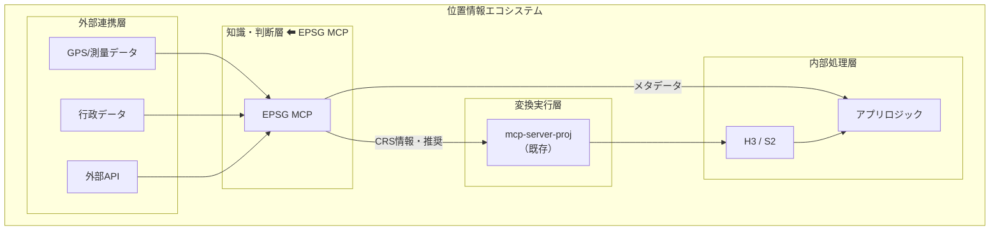
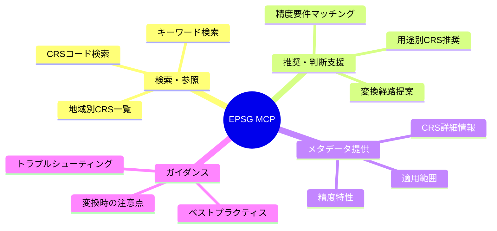
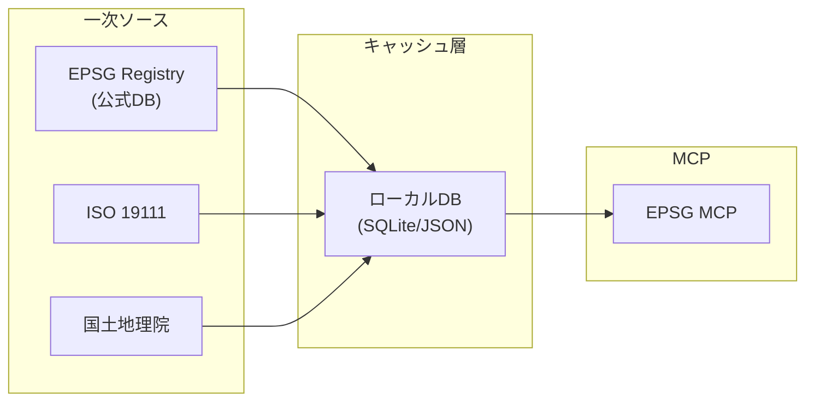
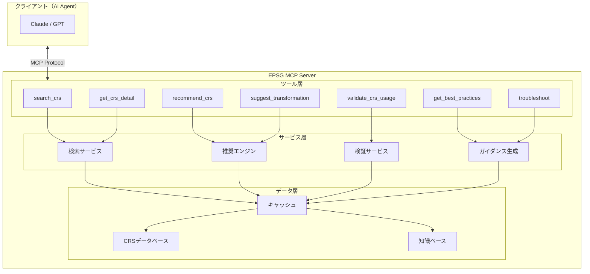
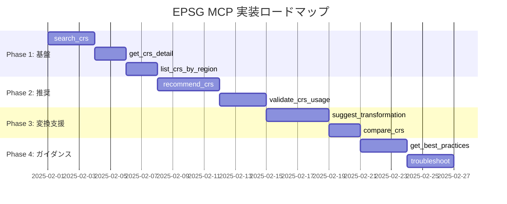
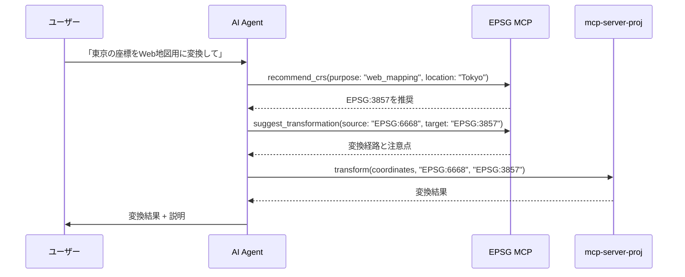

# EPSG MCP 設計書

## 1. ポジショニング



## 2. 基本方針

| 方針 | 説明 |
|------|------|
| **知識提供に特化** | 変換実行はprojに委譲 |
| **判断支援重視** | AIが価値を発揮する領域 |
| **実用性優先** | 日本での利用シーンを重視 |
| **拡張可能** | 将来的な機能追加を考慮 |

## 3. 機能一覧



## 4. ツール定義

### 4.1 検索・参照系

#### `search_crs`
```typescript
interface SearchCrsInput {
  query: string;           // 検索キーワード
  type?: CrsType;          // フィルタ: geographic | projected | compound
  region?: string;         // 地域フィルタ: "Japan", "Asia", etc.
  limit?: number;          // 結果数上限（デフォルト: 10）
}

interface SearchCrsOutput {
  results: CrsInfo[];
  totalCount: number;
}

interface CrsInfo {
  code: string;            // "EPSG:4326"
  name: string;            // "WGS 84"
  type: CrsType;
  region: string;
  description: string;
  deprecated: boolean;
}
```

**ユースケース：**
- 「日本で使える投影座標系を探したい」
- 「JGD2011に関連するCRSを知りたい」

#### `get_crs_detail`
```typescript
interface GetCrsDetailInput {
  code: string;            // "EPSG:6677" or "6677"
}

interface GetCrsDetailOutput {
  code: string;
  name: string;
  type: CrsType;
  datum: DatumInfo;
  coordinateSystem: CoordinateSystemInfo;
  areaOfUse: AreaOfUse;
  accuracy: AccuracyInfo;
  remarks: string;
  supersededBy?: string;   // 後継CRSがある場合
  relatedCrs: string[];    // 関連CRS
}

interface DatumInfo {
  name: string;
  type: string;            // "geodetic" | "vertical" | "engineering"
  ellipsoid?: EllipsoidInfo;
  primeMedian?: string;
}

interface AreaOfUse {
  description: string;
  boundingBox: {
    north: number;
    south: number;
    east: number;
    west: number;
  };
}

interface AccuracyInfo {
  horizontal?: string;     // "1m", "10cm" など
  vertical?: string;
  notes: string;
}
```

**ユースケース：**
- 「EPSG:6677の詳細を教えて」
- 「このCRSの適用範囲は？」

#### `list_crs_by_region`
```typescript
interface ListCrsByRegionInput {
  region: "Japan" | "Global" | string;
  type?: CrsType;
  includeDeprecated?: boolean;
}

interface ListCrsByRegionOutput {
  region: string;
  crsList: CrsInfo[];
  recommendedFor: {
    general: string;       // 汎用推奨
    survey: string;        // 測量用
    webMapping: string;    // Web地図用
  };
}
```

**ユースケース：**
- 「日本で使えるCRS一覧が欲しい」
- 「グローバルで使える地理座標系は？」

### 4.2 推奨・判断支援系

#### `recommend_crs`
```typescript
interface RecommendCrsInput {
  purpose: Purpose;
  location: LocationSpec;
  requirements?: Requirements;
}

type Purpose = 
  | "web_mapping"          // Web地図表示
  | "distance_calculation" // 距離計算
  | "area_calculation"     // 面積計算
  | "survey"               // 測量
  | "navigation"           // ナビゲーション
  | "data_exchange"        // データ交換
  | "storage"              // データ保存
  | "visualization";       // 可視化

interface LocationSpec {
  country?: string;
  region?: string;
  boundingBox?: BoundingBox;
  centerPoint?: { lat: number; lng: number };
}

interface Requirements {
  accuracy?: "high" | "medium" | "low";
  distortionTolerance?: "minimal" | "moderate" | "flexible";
  interoperability?: string[];  // 連携先システム
}

interface RecommendCrsOutput {
  primary: RecommendedCrs;
  alternatives: RecommendedCrs[];
  reasoning: string;
}

interface RecommendedCrs {
  code: string;
  name: string;
  score: number;           // 適合度 0-100
  pros: string[];
  cons: string[];
  usageNotes: string;
}
```

**ユースケース：**
- 「東京周辺で距離計算するのに最適なCRSは？」
- 「Webアプリで日本全国の地図を表示したい」

#### `suggest_transformation`
```typescript
interface SuggestTransformationInput {
  sourceCrs: string;
  targetCrs: string;
  location?: LocationSpec;  // 変換対象の位置（精度向上のため）
}

interface SuggestTransformationOutput {
  directPath: TransformationPath | null;
  viaPaths: TransformationPath[];
  recommended: TransformationPath;
  warnings: string[];
}

interface TransformationPath {
  steps: TransformationStep[];
  totalAccuracy: string;
  complexity: "simple" | "moderate" | "complex";
}

interface TransformationStep {
  from: string;
  to: string;
  method: string;
  accuracy: string;
  epsgCode?: string;       // 変換操作のEPSGコード
}
```

**ユースケース：**
- 「Tokyo Datum → JGD2011の変換方法は？」
- 「EPSG:4326 → EPSG:6677の推奨変換経路は？」

#### `validate_crs_usage`
```typescript
interface ValidateCrsUsageInput {
  crs: string;
  purpose: Purpose;
  location: LocationSpec;
}

interface ValidateCrsUsageOutput {
  isValid: boolean;
  score: number;           // 適合度 0-100
  issues: ValidationIssue[];
  suggestions: string[];
}

interface ValidationIssue {
  severity: "error" | "warning" | "info";
  message: string;
  recommendation: string;
}
```

**ユースケース：**
- 「Web MercatorをA北海道の面積計算に使って大丈夫？」
- 「EPSG:4326で距離計算すると問題ある？」

### 4.3 メタデータ・情報提供系

#### `get_datum_info`
```typescript
interface GetDatumInfoInput {
  datumName?: string;      // "JGD2011", "WGS 84"
  epsgCode?: string;       // DatumのEPSGコード
}

interface GetDatumInfoOutput {
  code: string;
  name: string;
  type: string;
  ellipsoid: EllipsoidInfo;
  realizationEpoch?: string;
  relatedCrs: string[];
  history: string;         // 成立経緯など
}

interface EllipsoidInfo {
  name: string;
  semiMajorAxis: number;
  inverseFlattening: number;
  epsgCode: string;
}
```

#### `get_projection_info`
```typescript
interface GetProjectionInfoInput {
  projectionName?: string; // "Transverse Mercator"
  epsgCode?: string;
}

interface GetProjectionInfoOutput {
  code: string;
  name: string;
  method: string;
  parameters: ProjectionParameter[];
  characteristics: {
    conformal: boolean;      // 正角図法か
    equalArea: boolean;      // 正積図法か
    equidistant: boolean;    // 正距図法か
    distortionPattern: string;
  };
  bestUseCases: string[];
  limitations: string[];
}
```

#### `compare_crs`
```typescript
interface CompareCrsInput {
  crs1: string;
  crs2: string;
  aspects?: ComparisonAspect[];
}

type ComparisonAspect = 
  | "accuracy"
  | "area_of_use"
  | "distortion"
  | "compatibility"
  | "use_cases";

interface CompareCrsOutput {
  comparison: {
    aspect: string;
    crs1Value: string;
    crs2Value: string;
    verdict: string;
  }[];
  summary: string;
  recommendation: string;
}
```

**ユースケース：**
- 「JGD2000とJGD2011の違いは？」
- 「Web MercatorとUTMの比較」

### 4.4 ガイダンス系

#### `get_best_practices`
```typescript
interface GetBestPracticesInput {
  topic: BestPracticeTopic;
  context?: string;
}

type BestPracticeTopic =
  | "japan_survey"           // 日本での測量
  | "web_mapping"            // Web地図開発
  | "data_exchange"          // データ交換
  | "coordinate_storage"     // 座標保存
  | "mobile_gps"             // モバイルGPS利用
  | "cross_border"           // 国境をまたぐデータ
  | "historical_data";       // 過去データの扱い

interface GetBestPracticesOutput {
  topic: string;
  practices: Practice[];
  commonMistakes: string[];
  references: string[];
}

interface Practice {
  title: string;
  description: string;
  example?: string;
  priority: "must" | "should" | "may";
}
```

#### `troubleshoot`
```typescript
interface TroubleshootInput {
  symptom: string;         // 「座標がずれる」「変換結果がおかしい」など
  context?: {
    sourceCrs?: string;
    targetCrs?: string;
    location?: string;
    tool?: string;
  };
}

interface TroubleshootOutput {
  possibleCauses: Cause[];
  diagnosticSteps: string[];
  solutions: Solution[];
}

interface Cause {
  likelihood: "high" | "medium" | "low";
  description: string;
  explanation: string;
}

interface Solution {
  cause: string;
  steps: string[];
  prevention: string;
}
```

**ユースケース：**
- 「座標が数百メートルずれる原因は？」
- 「変換後に南北が逆になった」

## 5. データソース



| ソース | 用途 | 更新頻度 |
|--------|------|----------|
| EPSG Registry | CRS定義、変換パラメータ | 年数回 |
| ISO 19111 | 用語定義、概念 | 静的 |
| 国土地理院 | 日本固有情報 | 年数回 |
| proj.db | 変換パラメータ補完 | proj更新時 |

## 6. アーキテクチャ



## 7. 技術スタック案

| 要素 | 選択肢 | 理由 |
|------|--------|------|
| **言語** | TypeScript | Shujiさんのスキルセット |
| **MCPフレームワーク** | @modelcontextprotocol/sdk | 標準SDK |
| **データ形式** | SQLite + JSON | 軽量・ポータブル |
| **EPSGデータ取得** | epsg.io API / proj.db | 実績あり |

## 8. 実装優先度



| Phase | 目的 | ツール |
|-------|------|--------|
| **1** | 基本的なCRS参照機能 | search, detail, list |
| **2** | AI価値の核心部分 | recommend, validate |
| **3** | 変換サポート | transformation, compare |
| **4** | ユーザー支援強化 | practices, troubleshoot |

## 9. mcp-server-proj との連携


