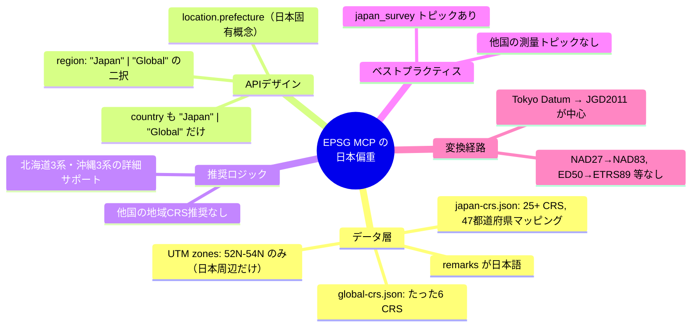
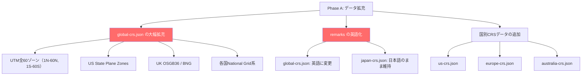
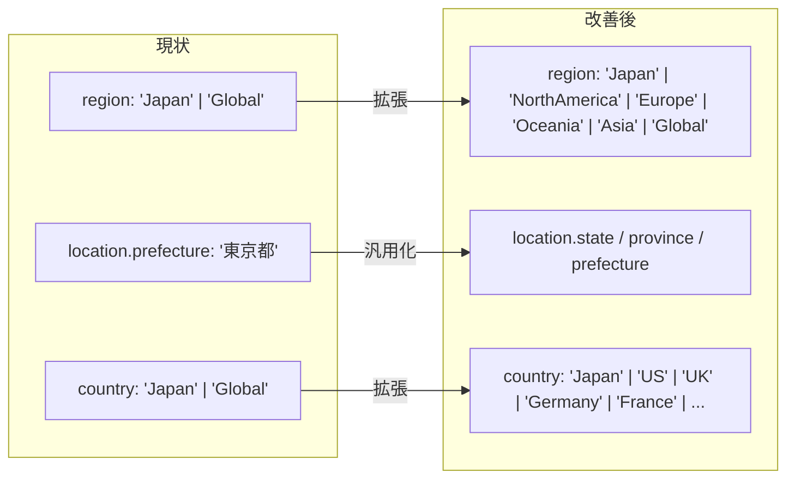
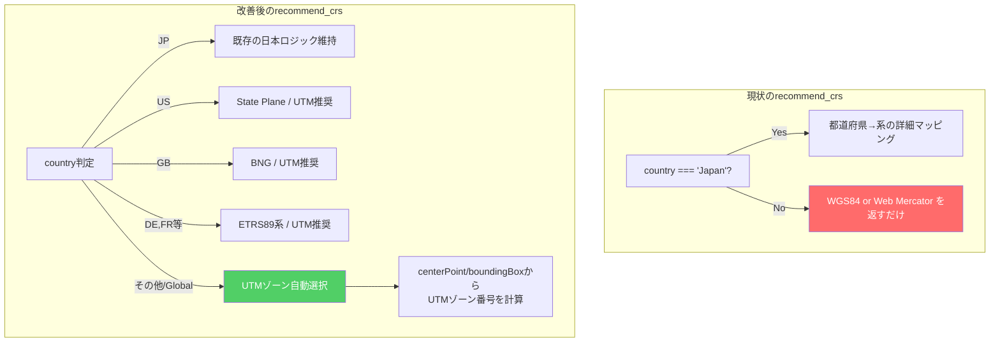
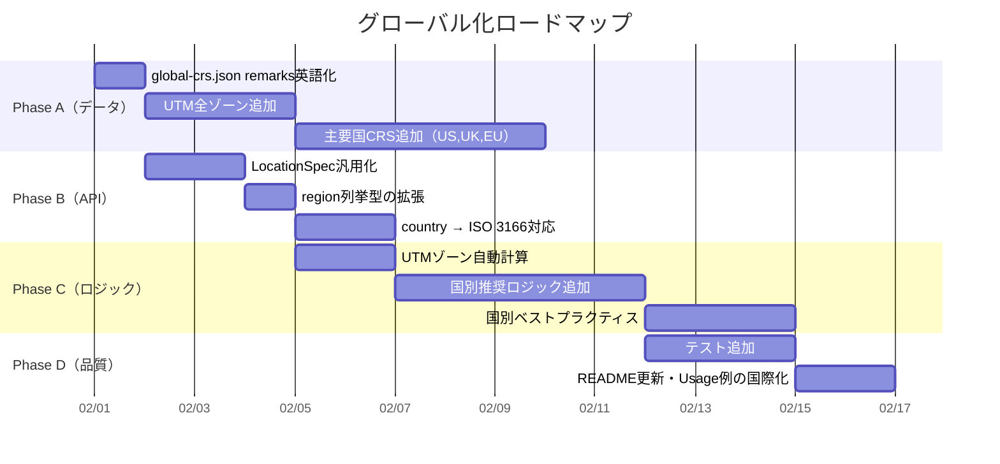

現状のコードとデータを詳しく確認しました。問題点と改善方針を整理します。

## 現状の分析：なぜ「日本専用」になっているか



### 具体的な格差

| 側面           | 日本                                               | グローバル                            |
| -------------- | -------------------------------------------------- | ------------------------------------- |
| CRSデータ数    | 25+ (JGD2011, 平面直角I-XIX, JGD2000, Tokyo Datum) | 6 (WGS84, NAD83, ETRS89, 3857, UTM×3) |
| 地域マッピング | 47都道府県 → ゾーンの完全マッピング                | なし                                  |
| UTMゾーン      | 52N-54N（日本周辺のみ）                            | 全60ゾーン中たった3つ                 |
| 推奨ロジック   | 用途×地域×複数系の詳細推奨                         | WGS84かWeb Mercatorの2択程度          |
| データ言語     | `remarks`が日本語                                  | `remarks`が日本語（！）               |

## 改善ロードマップ

### Phase A: データの国際化（最優先・効果大）



**具体的な追加CRS候補:**

```
【北米】
- EPSG:2263  NAD83 / New York Long Island (State Plane)
- EPSG:2229  NAD83 / California zone 5
- EPSG:3857  (既存)
- EPSG:6350  NAD83(2011) / Conus Albers
- UTM 10N-19N (米国本土カバー)

【ヨーロッパ】
- EPSG:27700  OSGB 1936 / British National Grid
- EPSG:2154   RGF93 v1 / Lambert-93 (フランス)
- EPSG:25832  ETRS89 / UTM zone 32N (ドイツ中心)
- EPSG:3035   ETRS89-extended / LAEA Europe

【オセアニア】
- EPSG:28356  GDA94 / MGA zone 56 (シドニー)
- EPSG:2193   NZGD2000 / NZTM 2000

【アジア（日本以外）】
- EPSG:4490   CGCS2000 (中国)
- EPSG:5186   Korean 2000 / Unified CS
```

### Phase B: APIデザインの汎用化

現在の `"Japan" | "Global"` の二択モデルを拡張します。



**LocationSpec の改善案:**

```typescript
// 現状
interface LocationSpec {
	country?: 'Japan' | 'Global';
	prefecture?: string; // 日本固有
	city?: string;
	region?: string;
	boundingBox?: BoundingBox;
	centerPoint?: { lat: number; lng: number };
}

// 改善後
interface LocationSpec {
	country?: string; // ISO 3166-1 alpha-2 ("JP", "US", "GB", "DE", ...)
	subdivision?: string; // 都道府県/州/県/省の統一フィールド
	city?: string;
	region?: string; // 地方名 ("Kanto", "Northeast US", "Western Europe")
	boundingBox?: BoundingBox;
	centerPoint?: { lat: number; lng: number };

	// 後方互換
	/** @deprecated Use `subdivision` instead */
	prefecture?: string;
}
```

**重要: 後方互換性を維持しつつ拡張する**ことがポイントです。`prefecture`をいきなり削除せず、`subdivision` へのエイリアスとして残します。

### Phase C: 推奨ロジックの汎用化



**UTMゾーン自動計算は最もインパクトが大きい改善**です。経度からゾーン番号を計算するだけで、世界中どこでも適切なProjected CRSを推奨できるようになります。

```typescript
// UTMゾーン番号の計算（実装例）
function getUtmZone(lng: number): number {
	return Math.floor((lng + 180) / 6) + 1;
}

function getUtmEpsg(lat: number, lng: number): string {
	const zone = getUtmZone(lng);
	const base = lat >= 0 ? 32600 : 32700; // N or S
	return `EPSG:${base + zone}`;
}
```

### Phase D: データ言語の整理

```
global-crs.json の remarks:
  現状: "北米測地系1983。アメリカ・カナダ・メキシコで使用。"  ← 日本語！
  改善: "North American Datum 1983. Used in the US, Canada, and Mexico."

japan-crs.json の remarks:
  → 日本語のまま維持（日本の利用者向け）
  → ただしツールの出力フォーマットにlocale概念を追加検討
```

## 優先順位の提案



### すぐにできる「クイックウィン」 Top 3

1. **`global-crs.json` の `remarks` を英語化** — 1時間で完了、グローバルユーザーへの最低限の対応
2. **UTMゾーン自動計算の追加** — `centerPoint`からUTMゾーンを計算する関数を追加するだけで、世界中の`recommend_crs`が劇的に改善
3. **`country`パラメータの ISO 3166化** — `"Japan"` → `"JP"` をエイリアスとして受け付けるだけで国際標準準拠

## アーキテクチャの方向性

現在のローカルJSON方式を維持しつつスケールさせる場合、データファイルの構造を見直す必要があります。

```
src/data/static/
├── japan-crs.json          # 既存（維持）
├── global-crs.json         # 拡充（UTM全ゾーン + 主要CRS）
├── regions/                # 新規：国別データ
│   ├── us-crs.json
│   ├── uk-crs.json
│   ├── europe-crs.json
│   └── australia-crs.json
├── recommendations.json    # 国別推奨ルール追加
├── transformations.json    # 国別変換経路追加
└── best-practices.json     # 国別ベストプラクティス追加
```

あるいは、EPSGレジストリのデータベース（SQLite形式で公開されている）をビルド時に取り込んで、ローカルJSONを自動生成するパイプラインを構築する方法もあります。これなら全CRSを網羅できますが、開発コストは大きくなります。

どのPhaseから着手するか、あるいは特定の国・地域を優先的にサポートしたいといった方針があれば、より具体的な実装プランを詰められます。
