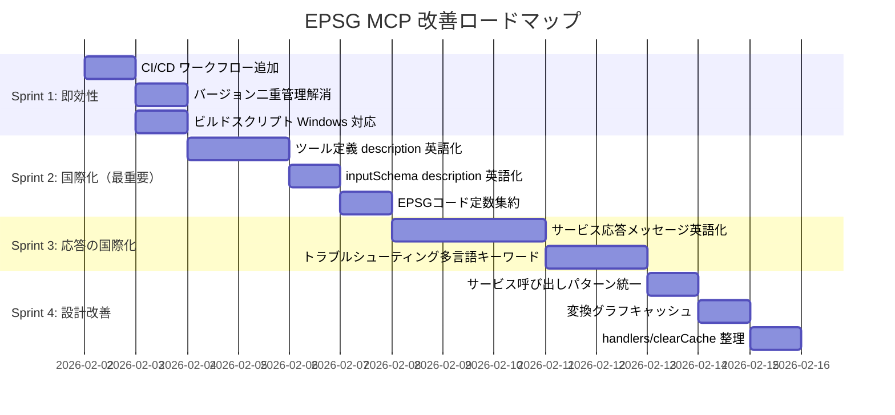

# EPSG MCP コードレビュー — 改善提案書

## 概要

海外ユーザー利用、ハードコーディング、パフォーマンス、メンテナンス性、コード設計、CI/CDの観点から包括的にレビューした結果をまとめます。

---

## 🔴 Critical — 海外ユーザーに影響する問題

### 1. ツール定義の `description` が日本語

**影響度**: 🔴 高（ツール発見・選択に直結）

MCPクライアントはツールの `description` を使ってAIにツール選択を案内します。
日本語のままでは英語圏のAIエージェントがツールの用途を正しく理解できません。

```typescript
// ❌ 現状 (src/tools/definitions.ts)
description: '用途と場所に応じた最適なCRSを推奨します。Web地図表示、距離計算...'

// ✅ 改善案
description: 'Recommend the optimal CRS based on purpose and location. Supports web mapping, distance/area calculation, surveying, navigation, data exchange, etc. Full support for Japan Plane Rectangular CS (Zones I-XIX) including multi-zone regions like Hokkaido and Okinawa.'
```

**対象ファイル**: `src/tools/definitions.ts`（全9ツール分）

### 2. サービス応答メッセージの日本語ハードコード

**影響度**: 🔴 高（ツールの出力をAIが解釈できない可能性）

```typescript
// ❌ comparison-service.ts
'WGS84とJGD2011は実用上同一（数cm以内）。日本国内データはJGD2011推奨。'

// ❌ transformation-service.ts
'同一のCRSが指定されました。変換は不要です。'
'広域のデータを変換する場合、位置によって精度が異なる場合があります。'

// ❌ comparison-service.ts の aspect フィールド
'測地系 (Datum)'  → 英語のAIはこれを分類キーとして使えない
'用途適性 (Use Cases)'
```

**改善案（段階的）**:

```
Phase A: 英語を主、日本語を補助に
  aspect: 'Datum'  (日本語は description 等で補足)
  
Phase B: i18n レイヤー導入
  import { t } from '../i18n/index.js';
  t('comparison.datum.verdict.equivalent')
```

### 3. トラブルシューティングの日本語キーワードマッチング

**影響度**: 🟠 中高（海外ユーザーは symptom を英語で入力する）

`troubleshooting-service.ts` のキーワードマッチングが完全に日本語依存：

```
'座標が400mずれる' → マッチ
'coordinates shifted by 400m' → マッチしない ❌
```

**改善案**: 日英両方のキーワードパターンを用意

```typescript
keywords: {
  ja: ['数百メートル', 'ずれ', '400m'],
  en: ['hundreds of meters', 'shift', 'offset', '400m']
}
```

### 4. 静的データ（JSON）内の日本語テキスト

**影響度**: 🟠 中（AIが翻訳できるが、精度が落ちる場合あり）

| ファイル | 日本語箇所 |
|---------|-----------|
| `japan-crs.json` | `remarks`, `areaOfUse.description`, `accuracy` |
| `best-practices.json` | `title`, `description`, `practices[].description` 全体 |
| `troubleshooting.json` | `symptoms`, `causes`, `solutions` 全体 |
| `comparisons.json` | 比較テンプレート |
| `recommendations.json` | `reasoning`, `warnings` |

**推奨対応**: 最低限、ツール定義とサービス応答を英語化。データ層は将来のi18n対応として計画。

---

## 🟡 Important — ハードコーディング・冗長性

### 5. バージョンの二重管理

```typescript
// ❌ src/index.ts
const server = new Server({
  name: 'epsg-mcp',
  version: '1.0.0',  // package.json とずれるリスク
}, ...);
```

**改善案**:

```typescript
import { createRequire } from 'node:module';
const require = createRequire(import.meta.url);
const { version } = require('../package.json');

const server = new Server({
  name: 'epsg-mcp',
  version,
}, ...);
```

### 6. ビルドスクリプトのクロスプラットフォーム非対応

```json
// ❌ package.json
"build": "tsc && cp -r src/data/static build/data/ && chmod 755 build/index.js"
```

`cp -r` と `chmod` は Windows で動作しません。

**改善案A**: `shx` を使用

```json
"devDependencies": {
  "shx": "^0.3.4"
},
"scripts": {
  "build": "tsc && shx cp -r src/data/static build/data/ && shx chmod 755 build/index.js"
}
```

**改善案B**: Node.js スクリプトに切り出し

```json
"build": "tsc && node scripts/post-build.mjs"
```

### 7. EPSGコード定数の散在

コード全体にマジックストリングが散在しています。

```typescript
// ❌ 散在例
if (crs1.code === 'EPSG:4326' && crs2.code === 'EPSG:6668')
if (crs.code === 'EPSG:3857')

// ✅ 定数ファイルに集約
// src/constants/epsg.ts
export const EPSG = {
  WGS84: 'EPSG:4326',
  WEB_MERCATOR: 'EPSG:3857',
  JGD2011: 'EPSG:6668',
  JGD2000: 'EPSG:4612',
  TOKYO_DATUM: 'EPSG:4301',
  // Japan Plane Rectangular CS
  JPCS_I: 'EPSG:6669',
  JPCS_XIX: 'EPSG:6687',
} as const;
```

> 💡 `comparison-service.ts` には既に部分的に `EPSG` 定数がある。これを共通化すべき。

### 8. `inputSchema` 内の `description` が日本語

```typescript
// ❌ src/tools/definitions.ts
description: '検証対象のEPSGコード（例: "EPSG:3857" または "3857"）'
description: '都道府県名（"東京都", "北海道", "沖縄県" など）'
```

これもツール呼び出し時にAIが参照するフィールドのため、英語にすべき。

---

## ⚡ Performance — パフォーマンス改善

### 9. 変換グラフの毎回構築

`buildTransformationGraph()` が `findViaTransformations()` 内で毎回呼ばれる場合、
同じデータに対して何度もグラフを構築することになります。

**改善案**:

```typescript
let cachedGraph: Map<string, ...> | null = null;

function getTransformationGraph(data: TransformationData) {
  if (!cachedGraph) {
    cachedGraph = buildTransformationGraph(data);
  }
  return cachedGraph;
}
```

### 10. `preloadAll()` と `buildCrsIndex()` の二重ロード

```
起動時: preloadAll() → loadJapanCrs(), loadGlobalCrs(), ...
初回検索: buildCrsIndex() → loadJapanCrs(), loadGlobalCrs()（キャッシュヒット）
```

動作上は問題ないが、`preloadAll()` 内で `buildCrsIndex()` も呼ぶようにすれば、
初回ツール呼び出し時のインデックス構築コストがなくなります。

---

## 🏗️ Design — コード設計

### 11. サービス呼び出しパターンの不統一

```typescript
// パターンA: レジストリ経由（recommendation.ts, transformation.ts 等）
const services = getServices();
return await services.recommendCrs(...);

// パターンB: 直接import（テストコードや一部ハンドラー）
import { searchCrs } from '../../src/services/search-service.js';
```

**改善案**: レジストリパターンに統一（モック差し替えが容易）

### 12. `handlers.ts` が二重エクスポート構造

```typescript
// src/tools/handlers.ts - 個別エクスポート + toolHandlers マップ
export { handleSearchCrs, ... };  // ← 実質使われていない
export const toolHandlers = { ... };  // ← index.ts はこちらを使用
```

**改善案**: `toolHandlers` マップのみエクスポートし、個別エクスポートは削除

### 13. `clearCache()` のスコープ

`clearCache()` がグローバルキャッシュをリセットするが、
サービス内の局所キャッシュ（例: 変換グラフキャッシュ）はリセットされない可能性。

**改善案**: 各サービスに `reset()` メソッドを設け、`clearCache()` から一括呼び出し

---

## 🚀 CI/CD — npm publish 自動化

### 14. GitHub Actions ワークフロー

w3c-mcp / rfcxml-mcp と同パターンで導入：

#### `.github/workflows/publish.yml`

```yaml
name: Publish to npm

on:
  push:
    tags:
      - 'v*'

permissions:
  contents: read

jobs:
  publish:
    runs-on: ubuntu-latest
    steps:
      - name: Checkout
        uses: actions/checkout@v4

      - name: Setup Node.js
        uses: actions/setup-node@v4
        with:
          node-version: '20'
          registry-url: 'https://registry.npmjs.org'

      - name: Install dependencies
        run: npm ci

      - name: Run tests
        run: npm test

      - name: Build
        run: npm run build

      - name: Publish to npm
        run: npm publish --access public
        env:
          NODE_AUTH_TOKEN: ${{ secrets.NPM_TOKEN }}
```

#### `.github/workflows/ci.yml`

```yaml
name: CI

on:
  push:
    branches: [main]
  pull_request:
    branches: [main]

permissions:
  contents: read

jobs:
  test:
    runs-on: ubuntu-latest
    strategy:
      matrix:
        node-version: [18, 20, 22]
    steps:
      - name: Checkout
        uses: actions/checkout@v4

      - name: Setup Node.js ${{ matrix.node-version }}
        uses: actions/setup-node@v4
        with:
          node-version: ${{ matrix.node-version }}

      - name: Install dependencies
        run: npm ci

      - name: Lint
        run: npm run lint

      - name: Build
        run: npm run build

      - name: Test
        run: npm test
```

#### リリース手順

```bash
# 1. package.json の version を更新
npm version patch  # or minor, major

# 2. タグをプッシュ → CI が自動で npm publish
git push origin main --tags
```

> ✅ `NPM_TOKEN` は Actions secrets に設定済みとのことなので、
> ワークフローファイルを `.github/workflows/` に配置すれば即動作します。

---

## 📊 優先度マトリクス

| # | 改善項目 | 影響度 | 工数 | 優先度 |
|---|---------|--------|------|--------|
| 14 | CI/CD publish ワークフロー追加 | 🟢 低リスク | 小 | **★★★★★** |
| 1 | ツール定義 description 英語化 | 🔴 致命的 | 中 | **★★★★★** |
| 8 | inputSchema description 英語化 | 🔴 致命的 | 中 | **★★★★★** |
| 5 | バージョン二重管理の解消 | 🟡 バグ誘発 | 小 | **★★★★** |
| 6 | ビルドスクリプト Windows 対応 | 🟡 貢献阻害 | 小 | **★★★★** |
| 2 | サービス応答メッセージ英語化 | 🔴 高影響 | 大 | **★★★★** |
| 7 | EPSGコード定数集約 | 🟡 保守性 | 中 | **★★★** |
| 3 | トラブルシューティング多言語対応 | 🟠 中高 | 大 | **★★★** |
| 9 | 変換グラフキャッシュ | 🟢 パフォ | 小 | **★★★** |
| 10 | preloadAll のインデックス構築 | 🟢 パフォ | 小 | **★★** |
| 11 | サービス呼び出しパターン統一 | 🟡 設計 | 中 | **★★** |
| 12 | handlers.ts 二重エクスポート整理 | 🟢 保守性 | 小 | **★★** |
| 13 | clearCache スコープ | 🟡 テスト | 小 | **★★** |
| 4 | 静的データ JSON の多言語化 | 🟠 中 | 特大 | **★**（将来） |

---

## 🎯 推奨実施順序


