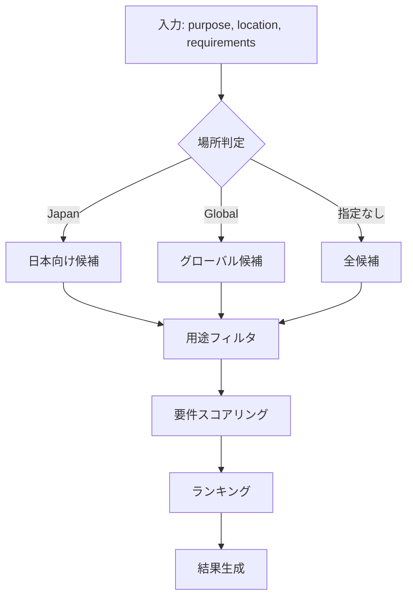

# Phase 2 実装計画書

## 概要

Phase 2では、AIエージェントの価値を最大化する**推奨・判断支援機能**を実装する。

| ツール               | 説明                          | 優先度 |
| -------------------- | ----------------------------- | ------ |
| `recommend_crs`      | 用途・場所に応じた最適CRS推奨 | 高     |
| `validate_crs_usage` | CRS選択の妥当性検証           | 高     |

## 1. recommend_crs

### 1.1 ツール定義

```typescript
interface RecommendCrsInput {
	purpose: Purpose;
	location: LocationSpec;
	requirements?: Requirements;
}

type Purpose =
	| 'web_mapping' // Web地図表示
	| 'distance_calculation' // 距離計算
	| 'area_calculation' // 面積計算
	| 'survey' // 測量
	| 'navigation' // ナビゲーション
	| 'data_exchange' // データ交換
	| 'data_storage' // データ保存
	| 'visualization'; // 可視化

interface LocationSpec {
	country?: string; // "Japan", "Global"
	region?: string; // "Kanto", "Hokkaido" など広域
	prefecture?: string; // "東京都", "北海道"
	city?: string; // "札幌市", "那覇市"（複数系またぐ地域用）
	boundingBox?: BoundingBox;
	centerPoint?: { lat: number; lng: number };
}

interface Requirements {
	accuracy?: 'high' | 'medium' | 'low';
	distortionTolerance?: 'minimal' | 'moderate' | 'flexible';
	interoperability?: string[]; // ["GIS", "CAD", "Web"]
}

interface RecommendCrsOutput {
	primary: RecommendedCrs;
	alternatives: RecommendedCrs[];
	reasoning: string;
	warnings?: string[];
}

interface RecommendedCrs {
	code: string;
	name: string;
	score: number; // 適合度 0-100
	pros: string[];
	cons: string[];
	usageNotes: string;
}
```

### 1.2 推奨ロジック



### 1.3 推奨ルール（recommendations.json 拡張）

```json
{
	"recommendationRules": {
		"web_mapping": {
			"global": {
				"primary": "EPSG:3857",
				"reasoning": "Web Mercatorは全てのWebマッピングライブラリで標準サポート",
				"pros": ["広範囲サポート", "高速レンダリング", "タイル互換"],
				"cons": ["面積歪み大", "極地域使用不可"]
			},
			"japan": {
				"primary": "EPSG:3857",
				"alternatives": ["EPSG:6668"],
				"reasoning": "表示にはWeb Mercator、データ保存にはJGD2011推奨"
			}
		},
		"survey": {
			"japan": {
				"primary": "EPSG:6669-6687",
				"zoneSelection": "prefecture_based",
				"reasoning": "平面直角座標系は国土地理院の公式測量座標系",
				"pros": ["高精度", "法的根拠", "公共測量対応"],
				"cons": ["系ごとの選択必要", "広域では系をまたぐ"]
			},
			"global": {
				"primary": "UTM",
				"reasoning": "UTMゾーンは全世界をカバーし、測量に適した精度"
			}
		},
		"distance_calculation": {
			"japan": {
				"primary": "EPSG:6669-6687",
				"fallback": "EPSG:6668",
				"reasoning": "投影座標系での計算が高精度、地理座標系では楕円体計算必要"
			},
			"global": {
				"primary": "UTM",
				"fallback": "EPSG:4326",
				"note": "4326使用時はHaversine/Vincentyなど楕円体計算が必要"
			}
		},
		"area_calculation": {
			"japan": {
				"primary": "EPSG:6669-6687",
				"warning": "Web Mercator(3857)は面積計算に不適切",
				"reasoning": "平面直角座標系は正角図法だが、面積歪みは許容範囲内"
			},
			"global": {
				"primary": "Equal-area projection",
				"examples": ["EPSG:6933"],
				"warning": "Web Mercatorの面積歪みは赤道で0%、緯度60度で4倍"
			}
		},
		"data_storage": {
			"global": {
				"primary": "EPSG:4326",
				"reasoning": "WGS84は最も広く互換性があり、長期保存に適する"
			},
			"japan": {
				"primary": "EPSG:6668",
				"reasoning": "JGD2011は日本の測地基準。4326との変換は実質等価"
			}
		},
		"data_exchange": {
			"global": {
				"primary": "EPSG:4326",
				"reasoning": "国際的なデータ交換標準。GeoJSONの推奨CRS"
			},
			"japan": {
				"primary": "EPSG:6668",
				"alternatives": ["EPSG:4326"],
				"reasoning": "国内データはJGD2011、国際連携は4326"
			}
		},
		"navigation": {
			"global": {
				"primary": "EPSG:4326",
				"reasoning": "GPSデバイスはWGS84座標を出力"
			},
			"japan": {
				"primary": "EPSG:6668",
				"note": "JGD2011はWGS84と実用上同一"
			}
		},
		"visualization": {
			"global": {
				"primary": "EPSG:3857",
				"alternatives": ["EPSG:4326"],
				"reasoning": "Web表示は3857、印刷地図は4326ベースの投影を検討"
			}
		}
	}
}
```

### 1.4 都道府県→系の自動判定

```typescript
// 既存の zoneMapping を活用
async function selectZoneForLocation(location: LocationSpec): Promise<string | null> {
	// 複数系またぐ地域の特別処理
	if (location.prefecture && isMultiZonePrefecture(location.prefecture)) {
		return selectZoneForMultiZonePrefecture(location);
	}

	if (location.prefecture) {
		const mapping = await getZoneMapping();
		const zoneInfo = mapping[location.prefecture];
		if (zoneInfo) {
			return zoneInfo.code; // "EPSG:6677" など
		}
	}

	if (location.centerPoint) {
		// 緯度経度から最適な系を判定
		return determineZoneFromCoordinate(location.centerPoint);
	}

	return null;
}
```

### 1.5 複数系をまたぐ地域の対応

北海道と沖縄県は複数の系にまたがるため、特別な処理が必要。

```typescript
const MULTI_ZONE_PREFECTURES = {
	北海道: {
		note: '3系にまたがる（西部=XI、中部=XII、東部=XIII）',
		subRegions: {
			// 振興局ベースの判定
			石狩: 'EPSG:6679', // XI
			空知: 'EPSG:6679',
			後志: 'EPSG:6679',
			胆振: 'EPSG:6679',
			日高: 'EPSG:6679',
			渡島: 'EPSG:6679',
			檜山: 'EPSG:6679',
			上川: 'EPSG:6680', // XII
			留萌: 'EPSG:6680',
			宗谷: 'EPSG:6680',
			オホーツク: 'EPSG:6680',
			十勝: 'EPSG:6681', // XIII
			釧路: 'EPSG:6681',
			根室: 'EPSG:6681',
		},
		cities: {
			札幌市: 'EPSG:6679',
			旭川市: 'EPSG:6680',
			釧路市: 'EPSG:6681',
			函館市: 'EPSG:6679',
			帯広市: 'EPSG:6681',
		},
		default: 'EPSG:6679', // 不明時は石狩（札幌）
	},
	沖縄県: {
		note: '3系にまたがる（本島=XV、先島=XVI、大東=XVII）',
		subRegions: {
			本島: 'EPSG:6683', // XV
			先島: 'EPSG:6684', // XVI（宮古・八重山）
			大東: 'EPSG:6685', // XVII
		},
		cities: {
			那覇市: 'EPSG:6683',
			宮古島市: 'EPSG:6684',
			石垣市: 'EPSG:6684',
		},
		default: 'EPSG:6683', // 不明時は那覇
	},
};

function selectZoneForMultiZonePrefecture(location: LocationSpec): string {
	const prefConfig = MULTI_ZONE_PREFECTURES[location.prefecture!];

	// 市が指定されていれば使用
	if (location.city && prefConfig.cities[location.city]) {
		return prefConfig.cities[location.city];
	}

	// 地域が指定されていれば使用
	if (location.region && prefConfig.subRegions[location.region]) {
		return prefConfig.subRegions[location.region];
	}

	// 緯度経度があれば計算
	if (location.centerPoint) {
		return determineZoneFromCoordinate(location.centerPoint);
	}

	// デフォルト（警告付き）
	return prefConfig.default;
}
```

## 2. validate_crs_usage

### 2.1 ツール定義

```typescript
interface ValidateCrsUsageInput {
	crs: string; // "EPSG:4326", "4326"
	purpose: Purpose;
	location: LocationSpec;
}

interface ValidateCrsUsageOutput {
	isValid: boolean;
	score: number; // 適合度 0-100
	issues: ValidationIssue[];
	suggestions: string[];
	betterAlternatives?: RecommendedCrs[];
}

// 型安全なIssueコード定義
type ValidationIssueCode =
	| 'DEPRECATED_CRS'
	| 'LEGACY_DATUM'
	| 'AREA_MISMATCH'
	| 'AREA_DISTORTION'
	| 'DISTANCE_DISTORTION'
	| 'PRECISION_LOSS'
	| 'ZONE_MISMATCH'
	| 'CROSS_ZONE_CALCULATION'
	| 'DEPRECATED_STORAGE'
	| 'GEOJSON_INCOMPATIBLE'
	| 'NOT_OFFICIAL_SURVEY_CRS'
	| 'GEOGRAPHIC_AREA'
	| 'GEOGRAPHIC_DISTANCE'
	| 'BETTER_ALTERNATIVE'
	| 'GPS_CONVERSION_NEEDED'
	| 'PROJECTED_STORAGE'
	| 'NON_STANDARD_EXCHANGE'
	| 'NON_STANDARD_WEB_CRS';

interface ValidationIssue {
	severity: 'error' | 'warning' | 'info';
	code: ValidationIssueCode; // 型安全
	message: string;
	recommendation: string;
}
```

### 2.2 検証ルール

| コード                    | 重大度  | 検証内容                      |
| ------------------------- | ------- | ----------------------------- |
| `DEPRECATED_CRS`          | error   | 非推奨CRSの使用               |
| `LEGACY_DATUM`            | error   | Tokyo Datum等の旧測地系使用   |
| `AREA_MISMATCH`           | error   | 適用範囲外での使用            |
| `AREA_DISTORTION`         | warning | 面積計算での歪み大（3857等）  |
| `DISTANCE_DISTORTION`     | warning | 距離計算での歪み（3857等）    |
| `PRECISION_LOSS`          | warning | 精度低下の可能性              |
| `ZONE_MISMATCH`           | warning | 日本の系が不適切              |
| `CROSS_ZONE_CALCULATION`  | warning | 複数の系をまたぐ計算          |
| `DEPRECATED_STORAGE`      | warning | 非推奨CRSでのデータ保存       |
| `GEOJSON_INCOMPATIBLE`    | warning | GeoJSON非互換（投影座標系）   |
| `NOT_OFFICIAL_SURVEY_CRS` | warning | 日本で公式測量CRS以外         |
| `GEOGRAPHIC_AREA`         | info    | 地理座標系での面積計算        |
| `GEOGRAPHIC_DISTANCE`     | info    | 地理座標系での距離計算        |
| `BETTER_ALTERNATIVE`      | info    | より適切な代替あり            |
| `GPS_CONVERSION_NEEDED`   | info    | GPS出力との変換必要           |
| `PROJECTED_STORAGE`       | info    | 投影座標系でのデータ保存      |
| `NON_STANDARD_EXCHANGE`   | info    | データ交換に非標準CRS         |
| `NON_STANDARD_WEB_CRS`    | info    | Web地図に非標準CRS            |

### 2.3 検証ロジック

```typescript
async function validateCrsUsage(input: ValidateCrsUsageInput): Promise<ValidateCrsUsageOutput> {
	const issues: ValidationIssue[] = [];
	const crsDetail = await getCrsDetail(input.crs);

	if (!crsDetail) {
		throw new NotFoundError(`CRS not found: ${input.crs}`);
	}

	// 1. 非推奨チェック
	if (crsDetail.deprecated) {
		issues.push({
			severity: 'error',
			code: 'DEPRECATED_CRS',
			message: `${crsDetail.code} is deprecated`,
			recommendation: crsDetail.supersededBy
				? `Use ${crsDetail.supersededBy} instead`
				: 'Consider using a newer CRS',
		});
	}

	// 2. 適用範囲チェック
	if (!isLocationWithinArea(input.location, crsDetail.areaOfUse)) {
		issues.push({
			severity: 'error',
			code: 'AREA_MISMATCH',
			message: `Location is outside the area of use for ${crsDetail.code}`,
			recommendation: 'Select a CRS appropriate for your location',
		});
	}

	// 3. 用途別チェック
	const purposeIssues = validateForPurpose(crsDetail, input.purpose, input.location);
	issues.push(...purposeIssues);

	// 4. スコア計算
	const score = calculateValidationScore(issues);

	// 5. 代替案提案
	const betterAlternatives =
		score < 70 ? await findBetterAlternatives(input.purpose, input.location) : undefined;

	return {
		isValid: !issues.some((i) => i.severity === 'error'),
		score,
		issues,
		suggestions: generateSuggestions(issues),
		betterAlternatives,
	};
}
```

### 2.4 用途別検証ルール

```typescript
function validateForPurpose(
	crs: CrsDetail,
	purpose: Purpose,
	location: LocationSpec,
): ValidationIssue[] {
	const issues: ValidationIssue[] = [];

	switch (purpose) {
		case 'area_calculation':
			// Web Mercatorの面積歪み
			if (crs.code === 'EPSG:3857') {
				issues.push({
					severity: 'warning',
					code: 'AREA_DISTORTION',
					message: 'Web Mercator causes significant area distortion',
					recommendation: 'Use an equal-area or local projected CRS',
				});
			}
			// 地理座標系での面積計算
			if (crs.type === 'geographic') {
				issues.push({
					severity: 'info',
					code: 'GEOGRAPHIC_AREA',
					message: 'Geographic CRS requires spherical/ellipsoidal area calculation',
					recommendation: 'Use projected CRS or geodetic area formula',
				});
			}
			break;

		case 'distance_calculation':
			// 地理座標系での距離計算
			if (crs.type === 'geographic') {
				issues.push({
					severity: 'info',
					code: 'GEOGRAPHIC_DISTANCE',
					message: 'Geographic CRS requires geodetic distance calculation',
					recommendation: 'Use Haversine/Vincenty formula or a projected CRS',
				});
			}
			// Web Mercatorの距離歪み
			if (crs.code === 'EPSG:3857') {
				issues.push({
					severity: 'warning',
					code: 'DISTANCE_DISTORTION',
					message: 'Web Mercator distance varies significantly with latitude',
					recommendation: 'Use local projected CRS or geodetic calculation',
				});
			}
			// 系をまたぐ可能性
			if (isPlaneRectangularCS(crs.code) && location.boundingBox) {
				const spansMultipleZones = checkZoneSpan(location.boundingBox);
				if (spansMultipleZones) {
					issues.push({
						severity: 'warning',
						code: 'CROSS_ZONE_CALCULATION',
						message: 'Area spans multiple plane rectangular zones',
						recommendation: 'Use JGD2011 geographic (EPSG:6668) with geodetic calculation',
					});
				}
			}
			break;

		case 'survey':
			// 日本で平面直角座標系以外
			if (location.country === 'Japan' && !isPlaneRectangularCS(crs.code)) {
				issues.push({
					severity: 'warning',
					code: 'NOT_OFFICIAL_SURVEY_CRS',
					message: 'Not the official survey CRS for Japan',
					recommendation: 'Use Japan Plane Rectangular CS (EPSG:6669-6687)',
				});
			}
			// 正しい系かどうか
			if (location.country === 'Japan' && isPlaneRectangularCS(crs.code)) {
				const expectedZone = await selectZoneForLocation(location);
				if (expectedZone && expectedZone !== crs.code) {
					issues.push({
						severity: 'warning',
						code: 'ZONE_MISMATCH',
						message: `Expected ${expectedZone} for ${location.prefecture}, but ${crs.code} was specified`,
						recommendation: `Use ${expectedZone} for this location`,
					});
				}
			}
			// 非推奨測地系（Tokyo Datum）
			if (crs.code.startsWith('EPSG:26') || crs.code === 'EPSG:4301') {
				issues.push({
					severity: 'error',
					code: 'LEGACY_DATUM',
					message: 'Tokyo Datum (old Japanese datum) should not be used for new surveys',
					recommendation: 'Use JGD2011-based CRS (EPSG:6668 or EPSG:6669-6687)',
				});
			}
			break;

		case 'web_mapping':
			if (crs.code !== 'EPSG:3857' && crs.code !== 'EPSG:4326') {
				issues.push({
					severity: 'info',
					code: 'NON_STANDARD_WEB_CRS',
					message: 'This CRS may not be natively supported by web mapping libraries',
					recommendation: 'Consider EPSG:3857 for display or EPSG:4326 for GeoJSON',
				});
			}
			break;

		case 'navigation':
			// GPS出力との整合性
			if (crs.code !== 'EPSG:4326' && crs.code !== 'EPSG:6668') {
				issues.push({
					severity: 'info',
					code: 'GPS_CONVERSION_NEEDED',
					message: 'GPS devices output WGS84 coordinates',
					recommendation: 'Consider using EPSG:4326 or EPSG:6668 (practically equivalent)',
				});
			}
			break;

		case 'data_storage':
			// 投影座標系での保存
			if (crs.type === 'projected') {
				issues.push({
					severity: 'info',
					code: 'PROJECTED_STORAGE',
					message: 'Projected CRS may limit future reprojection flexibility',
					recommendation: 'Consider storing in geographic CRS (EPSG:4326 or EPSG:6668)',
				});
			}
			// 非推奨CRSでの保存
			if (crs.deprecated) {
				issues.push({
					severity: 'warning',
					code: 'DEPRECATED_STORAGE',
					message: 'Storing data in deprecated CRS may cause future compatibility issues',
					recommendation: `Migrate to ${crs.supersededBy || 'a current CRS'}`,
				});
			}
			break;

		case 'data_exchange':
			// 非標準CRS
			if (crs.code !== 'EPSG:4326' && crs.code !== 'EPSG:6668') {
				issues.push({
					severity: 'info',
					code: 'NON_STANDARD_EXCHANGE',
					message: 'EPSG:4326 is the most widely supported CRS for data exchange',
					recommendation: 'Consider converting to WGS84 for broader compatibility',
				});
			}
			// GeoJSON互換性
			if (crs.type === 'projected') {
				issues.push({
					severity: 'warning',
					code: 'GEOJSON_INCOMPATIBLE',
					message: 'GeoJSON specification requires WGS84 (EPSG:4326)',
					recommendation: 'Convert to EPSG:4326 for GeoJSON export',
				});
			}
			break;

		case 'visualization':
			// 基本的にweb_mappingと同じ
			if (crs.code !== 'EPSG:3857' && crs.code !== 'EPSG:4326') {
				issues.push({
					severity: 'info',
					code: 'NON_STANDARD_WEB_CRS',
					message: 'This CRS may not be natively supported by visualization libraries',
					recommendation: 'Consider EPSG:3857 for web display',
				});
			}
			break;
	}

	return issues;
}
```

## 3. 実装タスク

### 3.1 ファイル構成

```
src/
├── types/
│   └── index.ts              # 新しい型定義追加
├── schemas/
│   └── index.ts              # 新しいZodスキーマ追加
├── data/
│   └── static/
│       └── recommendations.json  # 推奨ルール拡張
├── services/
│   ├── search-service.ts     # 既存
│   └── recommendation-service.ts  # 新規
├── tools/
│   ├── definitions.ts        # ツール定義追加
│   └── handlers.ts           # ハンドラー追加
└── utils/
    └── validation.ts         # 新規：検証ユーティリティ
```

### 3.2 タスクリスト

#### Step 1: 型定義とスキーマ

- [ ] `Purpose` 型定義
- [ ] `LocationSpec` 型定義
- [ ] `Requirements` 型定義
- [ ] `RecommendCrsInput/Output` 型定義
- [ ] `ValidateCrsUsageInput/Output` 型定義
- [ ] `ValidationIssue` 型定義
- [ ] Zodスキーマ作成

#### Step 2: データ拡張

- [ ] `recommendations.json` に推奨ルール追加
- [ ] 都道府県→系マッピングの活用確認

#### Step 3: recommendation-service.ts

- [ ] `recommendCrs()` 関数
- [ ] `selectZoneForLocation()` 関数
- [ ] `calculateRecommendationScore()` 関数
- [ ] `generateReasoning()` 関数

#### Step 4: validation.ts

- [ ] `validateCrsUsage()` 関数
- [ ] `validateForPurpose()` 関数
- [ ] `isLocationWithinArea()` 関数
- [ ] `calculateValidationScore()` 関数

#### Step 5: ツール統合

- [ ] `definitions.ts` にツール定義追加
- [ ] `handlers.ts` にハンドラー追加
- [ ] `toolHandlers` マップに登録

#### Step 6: テスト

- [ ] `recommendation-service.test.ts`
- [ ] `validation.test.ts`
- [ ] `handlers.test.ts` に追加テスト

## 4. テストケース

### 4.1 recommend_crs

| シナリオ | 入力 | 期待結果 |
| -------- | ---- | -------- |
| 東京でWeb地図 | purpose: "web_mapping", location: { prefecture: "東京都" } | primary: EPSG:3857 |
| 東京で測量 | purpose: "survey", location: { prefecture: "東京都" } | primary: EPSG:6677 |
| 北海道札幌で測量 | purpose: "survey", location: { prefecture: "北海道", city: "札幌市" } | primary: EPSG:6679 (XI) |
| 北海道釧路で測量 | purpose: "survey", location: { prefecture: "北海道", city: "釧路市" } | primary: EPSG:6681 (XIII) |
| 沖縄本島で測量 | purpose: "survey", location: { prefecture: "沖縄県", region: "本島" } | primary: EPSG:6683 (XV) |
| 沖縄宮古島で測量 | purpose: "survey", location: { prefecture: "沖縄県", city: "宮古島市" } | primary: EPSG:6684 (XVI) |
| 北海道で面積計算 | purpose: "area_calculation", location: { prefecture: "北海道" } | primary: EPSG:6679 + warning |
| グローバルデータ保存 | purpose: "data_storage", location: { country: "Global" } | primary: EPSG:4326 |
| 広域（東京〜大阪）距離計算 | purpose: "distance_calculation", boundingBox: {...} | primary: EPSG:6668 + warning |
| GeoJSON出力 | purpose: "data_exchange", location: { country: "Japan" } | primary: EPSG:4326 |
| ナビゲーション | purpose: "navigation", location: { country: "Japan" } | primary: EPSG:6668 |

### 4.2 validate_crs_usage

| シナリオ | 入力 | 期待結果 |
| -------- | ---- | -------- |
| 3857で面積計算 | crs: "3857", purpose: "area_calculation" | warning: AREA_DISTORTION |
| 3857で距離計算 | crs: "3857", purpose: "distance_calculation" | warning: DISTANCE_DISTORTION |
| 4326で距離計算 | crs: "4326", purpose: "distance_calculation" | info: GEOGRAPHIC_DISTANCE |
| 4326で面積計算 | crs: "4326", purpose: "area_calculation" | info: GEOGRAPHIC_AREA |
| 4326でGeoJSON | crs: "4326", purpose: "data_exchange" | isValid: true, score: 100 |
| 非推奨CRS使用 | crs: "4612", purpose: any | error: DEPRECATED_CRS |
| Tokyo Datumで測量 | crs: "4301", purpose: "survey" | error: LEGACY_DATUM |
| 東京で系IXは適切 | crs: "6677", purpose: "survey", prefecture: "東京都" | isValid: true, score: 100 |
| 東京で系Iは不適切 | crs: "6669", purpose: "survey", prefecture: "東京都" | warning: ZONE_MISMATCH |
| 投影座標系でデータ保存 | crs: "6677", purpose: "data_storage" | info: PROJECTED_STORAGE |
| 投影座標系でデータ交換 | crs: "6677", purpose: "data_exchange" | warning: GEOJSON_INCOMPATIBLE |
| 複数系またぎ | crs: "6677", boundingBox: 東京〜仙台 | warning: CROSS_ZONE_CALCULATION |
| GPS用にJGD2011 | crs: "6668", purpose: "navigation" | isValid: true (4326と同等) |
| GPS用に投影CRS | crs: "6677", purpose: "navigation" | info: GPS_CONVERSION_NEEDED |

## 5. 検証方法

### 5.1 ビルド・テスト

```bash
npm run build
npm test
```

### 5.2 MCP Inspector

```bash
npx @anthropic-ai/mcp-inspector build/index.js
```

### 5.3 Claude Codeでの統合テスト

- 「東京周辺で距離計算するのに最適なCRSは？」
- 「Web MercatorをA北海道の面積計算に使って大丈夫？」
- 「EPSG:4326で日本の測量データを保存しても問題ない？」

## 6. 見積もり

| タスク | 工数 |
| ------ | ---- |
| 型定義・スキーマ（ValidationIssueCode含む） | 1日 |
| データ拡張（複数系対応含む） | 1日 |
| recommendation-service | 1.5日 |
| validation（全用途対応） | 1.5日 |
| ツール統合 | 0.5日 |
| テスト（追加ケース含む） | 1.5日 |
| **合計** | **7日** |

---

## 7. 改訂履歴

### v1.1 (レビュー反映)

**追加対応:**

1. **全用途の検証ルール実装**
   - `navigation`, `data_storage`, `data_exchange`, `visualization` の検証ロジック追加
   - Web Mercatorの距離計算チェック追加

2. **複数系をまたぐ地域対応**
   - 北海道（XI, XII, XIII系）のサブリージョン・市区町村マッピング
   - 沖縄県（XV, XVI, XVII系）のサブリージョン・市区町村マッピング
   - `LocationSpec` に `city` フィールド追加

3. **型安全性強化**
   - `ValidationIssueCode` 型定義追加（18種類）
   - typo防止、IDE補完対応

4. **検証ルール拡充**
   - `LEGACY_DATUM` (Tokyo Datum検出)
   - `CROSS_ZONE_CALCULATION` (系またぎ警告)
   - `GEOJSON_INCOMPATIBLE` (GeoJSON互換性)
   - その他9種類のルール追加

5. **テストケース追加**
   - 北海道・沖縄の複数系テスト
   - 広域計算時の系またぎテスト
   - GeoJSON互換性テスト
