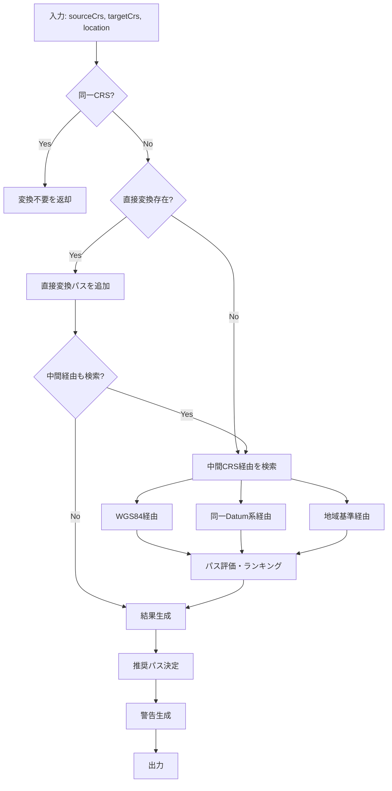
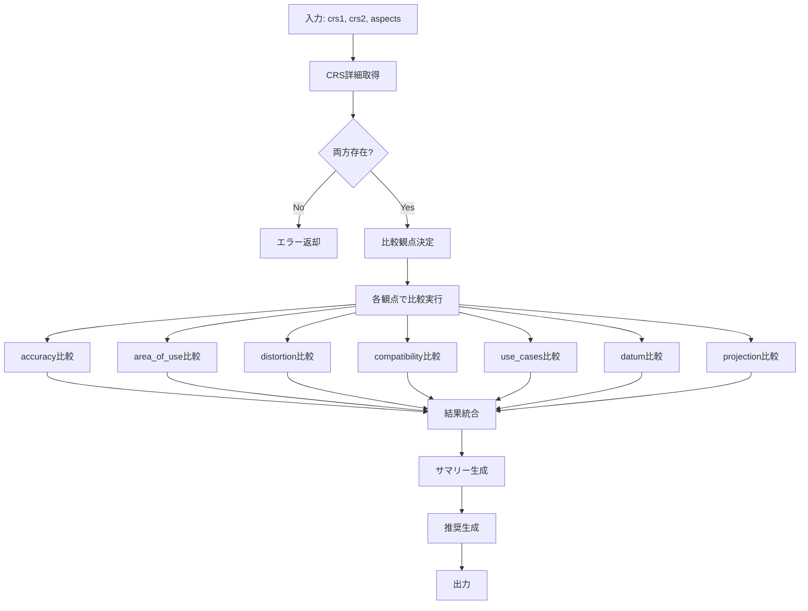

# Phase 3 実装計画書

## 概要

Phase 3では、**変換支援機能**を実装する。CRS間の変換経路提案と、CRS同士の比較機能を提供する。

| ツール                   | 説明                       | 優先度 |
| ------------------------ | -------------------------- | ------ |
| `suggest_transformation` | CRS間の変換経路提案        | 高     |
| `compare_crs`            | 2つのCRSの比較・違いの説明 | 高     |

## 1. suggest_transformation

### 1.1 ツール定義

**注記:** `LocationSpec` は Phase 2 で定義済みの型を再利用します。

```typescript
// Phase 2 から再利用
import type { LocationSpec } from '../types/index.js';

interface SuggestTransformationInput {
	sourceCrs: string; // "EPSG:4301", "4301"
	targetCrs: string; // "EPSG:6668", "6668"
	location?: LocationSpec; // 変換対象の位置（精度向上のため）
}

interface SuggestTransformationOutput {
	directPath: TransformationPath | null; // 直接変換可能な場合
	viaPaths: TransformationPath[]; // 中間CRSを経由する変換
	recommended: TransformationPath; // 推奨される変換経路
	warnings: string[]; // 注意事項
}

interface TransformationPath {
	steps: TransformationStep[];
	totalAccuracy: string; // "1m", "数cm" など
	complexity: 'simple' | 'moderate' | 'complex';
	estimatedPrecisionLoss?: string; // 累積精度損失の説明
}

interface TransformationStep {
	from: string; // "EPSG:4301"
	to: string; // "EPSG:6668"
	method: string; // "Geocentric translation", "Helmert 7-parameter"
	accuracy: string; // "1-2m", "数cm"
	epsgCode?: string; // 変換操作のEPSGコード（例: "EPSG:15483"）
	notes?: string; // 特記事項
}
```

### 1.2 提案ロジック



### 1.3 変換データ（transformations.json）

```json
{
	"version": "1.0.0",
	"transformations": [
		{
			"id": "EPSG:15483",
			"from": "EPSG:4301",
			"to": "EPSG:4612",
			"method": "Geocentric translations (geog2D domain)",
			"accuracy": "1-2m",
			"reversible": true,
			"parameters": {
				"dx": -146.414,
				"dy": 507.337,
				"dz": 680.507
			},
			"description": "Tokyo → JGD2000 (Japan)",
			"notes": "日本国土地理院による公式パラメータ"
		},
		{
			"id": "EPSG:6190",
			"from": "EPSG:4612",
			"to": "EPSG:6668",
			"method": "Time-dependent Coordinate Frame rotation",
			"accuracy": "数cm",
			"reversible": true,
			"parameters": {
				"note": "地殻変動補正を含む"
			},
			"description": "JGD2000 → JGD2011 (Japan)",
			"notes": "東北地方太平洋沖地震による地殻変動対応"
		},
		{
			"id": "identity-wgs84-jgd2011",
			"from": "EPSG:4326",
			"to": "EPSG:6668",
			"method": "Identity (実用上同一)",
			"accuracy": "実用上同一（数cm以内）",
			"reversible": true,
			"description": "WGS84 → JGD2011",
			"notes": "測地学的には異なるが、実用上の差は無視可能"
		},
		{
			"id": "EPSG:9688",
			"from": "EPSG:4326",
			"to": "EPSG:3857",
			"method": "Popular Visualisation Pseudo-Mercator",
			"accuracy": "なし（座標変換のみ）",
			"reversible": true,
			"reverseNote": "高緯度では逆変換時に精度低下の可能性あり",
			"description": "WGS84 → Web Mercator",
			"notes": "Web地図表示用。面積・距離計算には不適"
		},
		{
			"id": "jgd2011-to-plane-rect",
			"from": "EPSG:6668",
			"to": "EPSG:6669-6687",
			"method": "Transverse Mercator",
			"accuracy": "高精度",
			"reversible": true,
			"description": "JGD2011 → 平面直角座標系（I-XIX系）",
			"notes": "系の選択は location.prefecture で決定"
		}
	],
	"commonPaths": {
		"tokyo_to_jgd2011": {
			"description": "Tokyo Datum → JGD2011 変換",
			"steps": ["EPSG:4301 → EPSG:4612", "EPSG:4612 → EPSG:6668"],
			"totalAccuracy": "1-2m",
			"notes": "旧測地系から現行測地系への標準的な変換経路"
		},
		"jgd2000_to_jgd2011": {
			"description": "JGD2000 → JGD2011 変換",
			"steps": ["EPSG:4612 → EPSG:6668"],
			"totalAccuracy": "数cm",
			"notes": "2011年東北地方太平洋沖地震後の測地系移行"
		},
		"wgs84_to_web_mercator": {
			"description": "WGS84 → Web Mercator 変換",
			"steps": ["EPSG:4326 → EPSG:3857"],
			"totalAccuracy": "座標変換のみ",
			"notes": "Web地図表示用の標準変換"
		}
	},
	"hubCrs": ["EPSG:4326", "EPSG:6668", "EPSG:4612"],
	"deprecatedTransformations": {
		"EPSG:4301": {
			"note": "Tokyo Datumは非推奨。新規データには使用しないこと",
			"migrateTo": "EPSG:6668"
		}
	}
}
```

### 1.4 変換経路検索ロジック

**設計方針:**
- BFS（幅優先探索）で最短経路を探索（最大4ステップ）
- 逆方向変換も `reversible: true` の場合に自動生成
- ハブCRS（WGS84, JGD2011, JGD2000）を優先的に経由

```typescript
interface TransformationRecord {
	id: string;
	from: string;
	to: string;
	method: string;
	accuracy: string;
	reversible: boolean;       // 逆方向変換可能か
	reverseNote?: string;      // 逆方向特有の注記
	parameters?: Record<string, unknown>;
	description: string;
	notes?: string;
}

interface TransformationData {
	transformations: TransformationRecord[];
	commonPaths: Record<string, CommonPath>;
	hubCrs: string[];
	deprecatedTransformations: Record<string, DeprecationInfo>;
}

interface TransformationSearchOptions {
	maxSteps?: number;  // デフォルト: 4
}

async function suggestTransformation(
	input: SuggestTransformationInput
): Promise<SuggestTransformationOutput> {
	const { sourceCrs, targetCrs, location } = input;
	const warnings: string[] = [];

	// 正規化
	const source = normalizeCrsCode(sourceCrs);
	const target = normalizeCrsCode(targetCrs);

	// 同一CRSチェック
	if (source === target) {
		return {
			directPath: null,
			viaPaths: [],
			recommended: {
				steps: [],
				totalAccuracy: '変換不要',
				complexity: 'simple',
			},
			warnings: ['同一のCRSが指定されました。変換は不要です。'],
		};
	}

	// 非推奨チェック
	const transformData = await loadTransformations();
	if (transformData.deprecatedTransformations[source]) {
		const info = transformData.deprecatedTransformations[source];
		warnings.push(
			`${source} は非推奨です。${info.note} 新規データには ${info.migrateTo} を使用してください。`
		);
	}

	// 直接変換を検索
	const directPath = findDirectTransformation(source, target, transformData);

	// 中間CRS経由の変換を検索
	const viaPaths = findViaTransformations(source, target, transformData);

	// 推奨パスを決定
	const recommended = selectRecommendedPath(directPath, viaPaths, location);

	// 位置特有の警告
	if (location && isWideArea(location)) {
		warnings.push('広域のデータを変換する場合、位置によって精度が異なる場合があります。');
	}

	return {
		directPath,
		viaPaths,
		recommended,
		warnings,
	};
}

function findDirectTransformation(
	source: string,
	target: string,
	data: TransformationData
): TransformationPath | null {
	const transformation = data.transformations.find(
		(t) => t.from === source && t.to === target
	);

	if (!transformation) {
		return null;
	}

	return {
		steps: [
			{
				from: source,
				to: target,
				method: transformation.method,
				accuracy: transformation.accuracy,
				epsgCode: transformation.id,
				notes: transformation.notes,
			},
		],
		totalAccuracy: transformation.accuracy,
		complexity: 'simple',
	};
}

/**
 * 変換グラフを構築（逆方向変換も含む）
 */
function buildTransformationGraph(
	data: TransformationData
): Map<string, Array<{ to: string; record: TransformationRecord; isReverse: boolean }>> {
	const graph = new Map<string, Array<{ to: string; record: TransformationRecord; isReverse: boolean }>>();

	for (const t of data.transformations) {
		// 順方向
		if (!graph.has(t.from)) graph.set(t.from, []);
		graph.get(t.from)!.push({ to: t.to, record: t, isReverse: false });

		// 逆方向（reversible: true の場合）
		if (t.reversible) {
			if (!graph.has(t.to)) graph.set(t.to, []);
			graph.get(t.to)!.push({ to: t.from, record: t, isReverse: true });
		}
	}

	return graph;
}

/**
 * BFSで変換経路を探索（最大 maxSteps ステップ）
 */
function findViaTransformations(
	source: string,
	target: string,
	data: TransformationData,
	options: TransformationSearchOptions = {}
): TransformationPath[] {
	const maxSteps = options.maxSteps ?? 4;
	const graph = buildTransformationGraph(data);
	const paths: TransformationPath[] = [];

	// BFS用のキュー: [現在のCRS, これまでのステップ]
	const queue: Array<[string, TransformationStep[]]> = [[source, []]];
	const visited = new Set<string>();

	while (queue.length > 0) {
		const [current, steps] = queue.shift()!;

		if (steps.length >= maxSteps) continue;
		if (visited.has(current) && steps.length > 0) continue;
		visited.add(current);

		const edges = graph.get(current) || [];
		for (const edge of edges) {
			const step: TransformationStep = {
				from: current,
				to: edge.to,
				method: edge.isReverse ? `${edge.record.method} (逆変換)` : edge.record.method,
				accuracy: edge.record.accuracy,
				epsgCode: edge.record.id,
				notes: edge.isReverse ? edge.record.reverseNote : edge.record.notes,
			};

			const newSteps = [...steps, step];

			if (edge.to === target) {
				// 目的地に到達
				paths.push({
					steps: newSteps,
					totalAccuracy: calculateTotalAccuracyFromSteps(newSteps),
					complexity: newSteps.length === 1 ? 'simple' : newSteps.length === 2 ? 'moderate' : 'complex',
					estimatedPrecisionLoss: newSteps.length > 1 ? '累積誤差に注意' : undefined,
				});
			} else if (!visited.has(edge.to)) {
				queue.push([edge.to, newSteps]);
			}
		}
	}

	// ステップ数でソート（短い経路を優先）
	return paths.sort((a, b) => a.steps.length - b.steps.length);
}

function calculateTotalAccuracyFromSteps(steps: TransformationStep[]): string {
	// 複数ステップの精度を統合（最も悪い精度を採用）
	const accuracies = steps.map(s => s.accuracy);
	if (accuracies.includes('1-2m')) return '1-2m以上';
	if (accuracies.includes('数m')) return '数m以上';
	if (accuracies.some(a => a.includes('cm'))) return '数cm〜数m';
	return accuracies[0] || '不明';
}
```

### 1.5 主要な変換経路

| 変換元       | 変換先       | 方法                 | 精度        | 備考                     |
| ------------ | ------------ | -------------------- | ----------- | ------------------------ |
| Tokyo (4301) | JGD2000 (4612) | Geocentric translation | 1-2m      | 国土地理院パラメータ     |
| JGD2000 (4612) | JGD2011 (6668) | Time-dependent rotation | 数cm    | 地殻変動補正含む         |
| WGS84 (4326) | JGD2011 (6668) | Identity            | 数cm以内    | 実用上同一               |
| WGS84 (4326) | Web Mercator (3857) | Pseudo-Mercator | 座標変換のみ | 投影変換                 |
| JGD2011 (6668) | 平面直角 (6669-6687) | Transverse Mercator | 高精度 | 投影変換                 |

## 2. compare_crs

### 2.1 ツール定義

```typescript
interface CompareCrsInput {
	crs1: string; // "EPSG:4326", "4326"
	crs2: string; // "EPSG:6668", "6668"
	aspects?: ComparisonAspect[]; // 比較する観点（省略時は全て）
}

type ComparisonAspect =
	| 'accuracy' // 精度
	| 'area_of_use' // 適用範囲
	| 'distortion' // 歪み特性
	| 'compatibility' // 互換性
	| 'use_cases' // 用途
	| 'datum' // 測地系
	| 'projection'; // 投影法

interface CompareCrsOutput {
	comparison: ComparisonResult[];
	summary: string;
	recommendation: string;
	transformationNote?: string; // 変換に関する注記
}

interface ComparisonResult {
	aspect: string;
	crs1Value: string;
	crs2Value: string;
	verdict: string; // 判定・説明
}
```

### 2.2 比較ロジック



### 2.3 比較データ拡張（comparisons.json）

```json
{
	"version": "1.0.0",
	"crsCharacteristics": {
		"EPSG:4326": {
			"distortion": {
				"area": "なし（地理座標系）",
				"distance": "なし（地理座標系）",
				"shape": "なし（地理座標系）",
				"note": "地理座標系のため投影歪みはないが、平面計算には不向き"
			},
			"compatibility": {
				"gis": "高（ほぼ全てのGISで対応）",
				"web": "高（GeoJSON標準）",
				"cad": "中（変換が必要な場合あり）",
				"gps": "高（GPS標準出力）"
			},
			"useCasesScore": {
				"web_mapping": 80,
				"distance_calculation": 60,
				"area_calculation": 60,
				"survey": 40,
				"navigation": 100,
				"data_exchange": 100,
				"data_storage": 90,
				"visualization": 70
			}
		},
		"EPSG:6668": {
			"distortion": {
				"area": "なし（地理座標系）",
				"distance": "なし（地理座標系）",
				"shape": "なし（地理座標系）",
				"note": "WGS84と実用上同一だが、日本国内の公式測地系"
			},
			"compatibility": {
				"gis": "高（日本向けGISで標準）",
				"web": "高（4326と実用上同一）",
				"cad": "高（日本CADで対応）",
				"gps": "高（WGS84と実用上同一）"
			},
			"useCasesScore": {
				"web_mapping": 80,
				"distance_calculation": 60,
				"area_calculation": 60,
				"survey": 90,
				"navigation": 100,
				"data_exchange": 85,
				"data_storage": 95,
				"visualization": 70
			}
		},
		"EPSG:3857": {
			"distortion": {
				"area": "大（高緯度で著しい）",
				"distance": "中（緯度により変化）",
				"shape": "小（正角図法）",
				"note": "緯度35度で約23%、60度で約4倍の面積歪み"
			},
			"compatibility": {
				"gis": "高（Web GISで標準）",
				"web": "最高（全Webマッピングライブラリ対応）",
				"cad": "低（Web専用）",
				"gps": "低（変換必要）"
			},
			"useCasesScore": {
				"web_mapping": 100,
				"distance_calculation": 30,
				"area_calculation": 10,
				"survey": 10,
				"navigation": 40,
				"data_exchange": 50,
				"data_storage": 30,
				"visualization": 100
			}
		}
	},
	"comparisonTemplates": {
		"geographic_vs_projected": {
			"summary": "地理座標系と投影座標系の比較。用途に応じて使い分けが必要。",
			"considerations": [
				"地理座標系は度単位、投影座標系はメートル単位",
				"距離・面積計算は投影座標系が簡便",
				"広域データ保存は地理座標系が推奨"
			]
		},
		"wgs84_vs_jgd2011": {
			"summary": "WGS84とJGD2011は実用上同一（数cm以内）。日本国内データはJGD2011推奨。",
			"considerations": [
				"測地学的には異なる測地系",
				"実用上の座標差は数cm以内",
				"日本の公式測量・地図作成はJGD2011が基準"
			]
		}
	}
}
```

### 2.4 比較実装

```typescript
async function compareCrs(input: CompareCrsInput): Promise<CompareCrsOutput> {
	const { crs1, crs2, aspects } = input;

	// CRS詳細取得
	const detail1 = await getCrsDetail(normalizeCrsCode(crs1));
	const detail2 = await getCrsDetail(normalizeCrsCode(crs2));

	if (!detail1 || !detail2) {
		throw new NotFoundError('CRS', `${crs1} or ${crs2}`);
	}

	// 比較観点決定
	const targetAspects = aspects || [
		'datum',
		'projection',
		'area_of_use',
		'accuracy',
		'distortion',
		'compatibility',
		'use_cases',
	];

	// 各観点で比較
	const comparison: ComparisonResult[] = [];

	for (const aspect of targetAspects) {
		const result = compareAspect(detail1, detail2, aspect);
		comparison.push(result);
	}

	// サマリー・推奨生成
	const summary = generateComparisonSummary(detail1, detail2, comparison);
	const recommendation = generateRecommendation(detail1, detail2, comparison);

	// 変換注記
	const transformationNote = await getTransformationNote(detail1.code, detail2.code);

	return {
		comparison,
		summary,
		recommendation,
		transformationNote,
	};
}

function compareAspect(
	crs1: CrsDetail,
	crs2: CrsDetail,
	aspect: ComparisonAspect
): ComparisonResult {
	switch (aspect) {
		case 'datum':
			return compareDatum(crs1, crs2);
		case 'projection':
			return compareProjection(crs1, crs2);
		case 'area_of_use':
			return compareAreaOfUse(crs1, crs2);
		case 'accuracy':
			return compareAccuracy(crs1, crs2);
		case 'distortion':
			return compareDistortion(crs1, crs2);
		case 'compatibility':
			return compareCompatibility(crs1, crs2);
		case 'use_cases':
			return compareUseCases(crs1, crs2);
		default:
			throw new ValidationError(`Unknown comparison aspect: ${aspect}`);
	}
}

function compareDatum(crs1: CrsDetail, crs2: CrsDetail): ComparisonResult {
	const datum1 = crs1.datum?.name || 'N/A';
	const datum2 = crs2.datum?.name || 'N/A';

	let verdict: string;
	if (datum1 === datum2) {
		verdict = '同一の測地系を使用';
	} else if (
		(datum1.includes('WGS') && datum2.includes('JGD2011')) ||
		(datum1.includes('JGD2011') && datum2.includes('WGS'))
	) {
		verdict = '実用上同一（数cm以内の差）';
	} else if (datum1.includes('Tokyo') || datum2.includes('Tokyo')) {
		verdict = '旧測地系を含む。変換時に1-2mの誤差';
	} else {
		verdict = '異なる測地系。変換が必要';
	}

	return {
		aspect: '測地系 (Datum)',
		crs1Value: datum1,
		crs2Value: datum2,
		verdict,
	};
}

function compareProjection(crs1: CrsDetail, crs2: CrsDetail): ComparisonResult {
	const proj1 = crs1.projection?.method || '地理座標系（投影なし）';
	const proj2 = crs2.projection?.method || '地理座標系（投影なし）';

	let verdict: string;
	if (crs1.type === 'geographic' && crs2.type === 'geographic') {
		verdict = '両方とも地理座標系。投影歪みなし';
	} else if (crs1.type === 'projected' && crs2.type === 'projected') {
		if (proj1 === proj2) {
			verdict = '同一の投影法。パラメータが異なる可能性あり';
		} else {
			verdict = '異なる投影法。歪み特性が異なる';
		}
	} else {
		verdict = '地理座標系と投影座標系の比較。用途に応じて使い分け';
	}

	return {
		aspect: '投影法 (Projection)',
		crs1Value: proj1,
		crs2Value: proj2,
		verdict,
	};
}

/**
 * 用途適性を比較（スコア差をテキスト化 + 用途別勝敗表示）
 */
function compareUseCases(crs1: CrsDetail, crs2: CrsDetail): ComparisonResult {
	const chars = await loadComparisons();
	const scores1 = chars.crsCharacteristics[crs1.code]?.useCasesScore || {};
	const scores2 = chars.crsCharacteristics[crs2.code]?.useCasesScore || {};

	const purposes: Array<{ name: string; key: string }> = [
		{ name: 'Web地図', key: 'web_mapping' },
		{ name: '距離計算', key: 'distance_calculation' },
		{ name: '面積計算', key: 'area_calculation' },
		{ name: '測量', key: 'survey' },
		{ name: 'ナビ', key: 'navigation' },
		{ name: 'データ交換', key: 'data_exchange' },
		{ name: 'データ保存', key: 'data_storage' },
	];

	const better1: string[] = [];  // crs1が優位な用途
	const better2: string[] = [];  // crs2が優位な用途

	for (const p of purposes) {
		const s1 = scores1[p.key] || 50;
		const s2 = scores2[p.key] || 50;
		const diff = s1 - s2;
		if (diff >= 20) {
			better1.push(`${p.name}(+${diff})`);
		} else if (diff <= -20) {
			better2.push(`${p.name}(+${-diff})`);
		}
	}

	let verdict: string;
	if (better1.length === 0 && better2.length === 0) {
		verdict = '用途適性は同程度';
	} else {
		const parts: string[] = [];
		if (better1.length > 0) parts.push(`${crs1.code}優位: ${better1.join(', ')}`);
		if (better2.length > 0) parts.push(`${crs2.code}優位: ${better2.join(', ')}`);
		verdict = parts.join(' / ');
	}

	return {
		aspect: '用途適性 (Use Cases)',
		crs1Value: formatScoreSummary(scores1),
		crs2Value: formatScoreSummary(scores2),
		verdict,
	};
}

function formatScoreSummary(scores: Record<string, number>): string {
	const high = Object.entries(scores)
		.filter(([, v]) => v >= 80)
		.map(([k]) => k.replace('_', ' '));
	if (high.length === 0) return '特になし';
	return `高適性: ${high.slice(0, 3).join(', ')}`;
}
```

### 2.5 主要な比較パターン

| 比較パターン | 例 | ポイント |
| ------------ | -- | -------- |
| WGS84 vs JGD2011 | 4326 vs 6668 | 実用上同一、日本はJGD2011推奨 |
| JGD2000 vs JGD2011 | 4612 vs 6668 | 2011年地震後の地殻変動補正あり |
| WGS84 vs Web Mercator | 4326 vs 3857 | 地理 vs 投影、Web表示は3857 |
| 地理座標系 vs 平面直角 | 6668 vs 6677 | 保存は地理、計算は平面推奨 |
| Tokyo vs JGD2011 | 4301 vs 6668 | 旧測地系、1-2mの変換誤差 |

## 3. 実装タスク

### 3.1 ファイル構成

```
src/
├── types/
│   └── index.ts              # 新しい型定義追加
├── schemas/
│   └── index.ts              # 新しいZodスキーマ追加
├── data/
│   ├── loader.ts             # loadTransformations, loadComparisons 追加
│   └── static/
│       ├── transformations.json  # 新規：変換データ
│       └── comparisons.json      # 新規：比較データ
├── services/
│   ├── search-service.ts         # 既存
│   ├── recommendation-service.ts # 既存
│   ├── transformation-service.ts # 新規
│   └── comparison-service.ts     # 新規
├── tools/
│   ├── definitions.ts        # ツール定義追加
│   └── handlers.ts           # ハンドラー追加
└── utils/
    └── crs-utils.ts          # 新規：CRS関連ユーティリティ
tests/
├── services/
│   ├── transformation-service.test.ts  # 新規
│   └── comparison-service.test.ts      # 新規
└── tools/
    └── handlers.test.ts      # 追加テスト
```

### 3.2 タスクリスト

#### Step 1: 型定義とスキーマ

- [ ] `SuggestTransformationInput/Output` 型定義
- [ ] `TransformationPath`, `TransformationStep` 型定義
- [ ] `CompareCrsInput/Output` 型定義
- [ ] `ComparisonAspect`, `ComparisonResult` 型定義
- [ ] Zodスキーマ作成

#### Step 2: データ作成

- [ ] `src/data/static/transformations.json` 作成
  - 主要な変換パラメータ
  - ハブCRS定義
  - 非推奨変換情報
- [ ] `src/data/static/comparisons.json` 作成
  - CRS特性データ
  - 比較テンプレート
- [ ] `src/data/loader.ts` に読み込み関数追加

#### Step 3: transformation-service.ts

- [ ] `suggestTransformation()` 関数
- [ ] `findDirectTransformation()` 関数
- [ ] `findViaTransformations()` 関数
- [ ] `selectRecommendedPath()` 関数
- [ ] `calculateTotalAccuracy()` 関数

#### Step 4: comparison-service.ts

- [ ] `compareCrs()` 関数
- [ ] `compareAspect()` 関数（7観点対応）
  - `compareDatum()`
  - `compareProjection()`
  - `compareAreaOfUse()`
  - `compareAccuracy()`
  - `compareDistortion()`
  - `compareCompatibility()`
  - `compareUseCases()`
- [ ] `generateComparisonSummary()` 関数
- [ ] `generateRecommendation()` 関数

#### Step 5: crs-utils.ts

- [ ] `normalizeCrsCode()` 関数
- [ ] `isWideArea()` 関数
- [ ] `getTransformationNote()` 関数

#### Step 6: ツール統合

- [ ] `definitions.ts` にツール定義追加
- [ ] `handlers.ts` にハンドラー追加
- [ ] `toolHandlers` マップに登録

#### Step 7: テスト

- [ ] `transformation-service.test.ts`
- [ ] `comparison-service.test.ts`
- [ ] `handlers.test.ts` に追加テスト

## 4. テストケース

### 4.1 suggest_transformation

| シナリオ | 入力 | 期待結果 |
| -------- | ---- | -------- |
| Tokyo→JGD2011 | source: "4301", target: "6668" | 2ステップ変換、精度1-2m、警告あり |
| JGD2000→JGD2011 | source: "4612", target: "6668" | 1ステップ変換、精度数cm |
| WGS84→JGD2011 | source: "4326", target: "6668" | Identity、実用上同一 |
| WGS84→Web Mercator | source: "4326", target: "3857" | 1ステップ、投影変換 |
| 同一CRS | source: "4326", target: "4326" | 変換不要の警告 |
| JGD2011→平面直角 | source: "6668", target: "6677" | 1ステップ、投影変換 |
| **Tokyo→平面直角** | source: "4301", target: "6677" | **3ステップ変換**（4301→4612→6668→6677）、複雑度: complex |
| 逆方向変換 | source: "6668", target: "4326" | 1ステップ（逆変換）、実用上同一 |
| 非推奨CRS | source: "4301", target: any | 非推奨警告含む |
| 広域データ | location: 東北〜九州 | 広域警告含む |

### 4.2 compare_crs

| シナリオ | 入力 | 期待結果 |
| -------- | ---- | -------- |
| WGS84 vs JGD2011 | crs1: "4326", crs2: "6668" | 実用上同一、日本はJGD2011推奨 |
| WGS84 vs Web Mercator | crs1: "4326", crs2: "3857" | 地理vs投影、用途で使い分け |
| JGD2000 vs JGD2011 | crs1: "4612", crs2: "6668" | 地殻変動補正の説明 |
| Tokyo vs JGD2011 | crs1: "4301", crs2: "6668" | 旧測地系警告、移行推奨 |
| 平面直角IX vs WGS84 | crs1: "6677", crs2: "4326" | 測量vs保存の使い分け |
| 観点指定 | aspects: ["datum", "accuracy"] | 指定観点のみ比較 |
| 存在しないCRS | crs1: "99999" | NotFoundError |

## 5. 検証方法

### 5.1 ビルド・テスト

```bash
npm run build
npm test
```

### 5.2 MCP Inspector

```bash
npx @anthropic-ai/mcp-inspector build/index.js
```

### 5.3 Claude Codeでの統合テスト

- 「Tokyo Datum → JGD2011の変換方法は？」
- 「EPSG:4326からEPSG:3857への変換精度は？」
- 「WGS84とJGD2011の違いは？」
- 「JGD2000からJGD2011に変換するとき、何に気をつければいい？」

## 6. 見積もり

| タスク | 工数 |
| ------ | ---- |
| 型定義・スキーマ | 0.5日 |
| データ作成（transformations.json, comparisons.json） | 1日 |
| transformation-service | 1.5日 |
| comparison-service | 1.5日 |
| crs-utils | 0.5日 |
| ツール統合 | 0.5日 |
| テスト | 1.5日 |
| **合計** | **7日** |

## 7. 注意事項

### 7.1 変換精度について

- 変換精度は累積する可能性がある
- 中間CRSを経由すると精度が低下する
- 位置によって精度が異なる場合がある（特に広域データ）

### 7.2 非推奨CRSの扱い

- Tokyo Datum (EPSG:4301) は新規データには使用しない
- JGD2000 (EPSG:4612) も非推奨だが、既存データの変換は必要
- 変換時には必ず警告を表示

### 7.3 実用上同一の扱い

- WGS84 (EPSG:4326) と JGD2011 (EPSG:6668) は実用上同一
- 測地学的には異なるが、数cm以内の差
- 日本国内データはJGD2011使用を推奨

### 7.4 逆方向変換の扱い

- `reversible: true` の変換は逆方向も自動的に検索対象
- 逆方向特有の注記がある場合は `reverseNote` に記載
- 一部の変換（Web Mercator → WGS84など）は高緯度で精度低下の可能性

### 7.5 グラフ探索の制限

- 最大4ステップまでの経路を探索
- ステップ数が少ない経路を優先
- 累積誤差の警告を表示

---

## 8. 将来のPhase（参考）

- **Phase 4**: `get_best_practices`, `troubleshoot`
  - ベストプラクティス提供
  - トラブルシューティング支援
