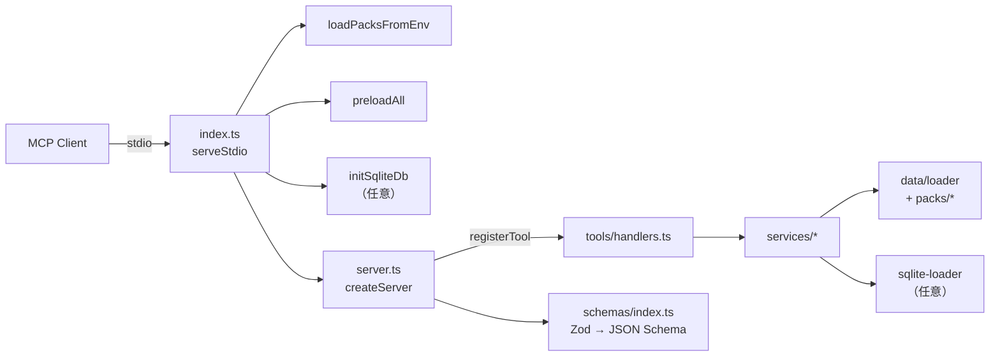

# Project Architecture

EPSG MCP Server のソースコード構成。各ディレクトリ・ファイルの役割を一覧化する。

## ディレクトリ構成

```
src/
├── index.ts                # エントリポイント（データのプリロード → serveStdio）
├── server.ts               # createServer(): McpServer の組み立てとツール登録
├── types/                  # 型定義（ValidationIssueCode等）
├── schemas/                # Zodスキーマ
├── errors/                 # エラーハンドリング
├── constants/
│   ├── index.ts            # 定数エクスポート
│   └── messages.ts         # メッセージ定数（i18n対応）
├── utils/
│   ├── logger.ts           # ロガー
│   ├── validation.ts       # CRS検証ユーティリティ（Phase 2）
│   ├── location-normalizer.ts # 位置情報正規化
│   └── utm.ts              # UTMゾーン計算
├── data/
│   ├── loader.ts           # データローダー（EPSG_LANG対応）
│   ├── sqlite-loader.ts    # SQLiteローダー（オプショナル）
│   └── static/
│       ├── japan-crs.json       # 日本CRSデータ
│       ├── global-crs.json      # グローバルCRSデータ
│       ├── recommendations.json # 推奨ルール（日本語）
│       ├── transformations.json # 変換経路データ
│       ├── comparisons.json     # CRS比較データ
│       ├── best-practices.json  # ベストプラクティス（日本語）
│       ├── troubleshooting.json # トラブルシューティング（日本語）
│       └── en/                  # 英語ローカライズファイル
│           ├── recommendations.json
│           ├── best-practices.json
│           └── troubleshooting.json
├── services/
│   ├── search-service.ts            # 検索サービス
│   ├── recommendation-service.ts    # 推奨サービス（Phase 2）
│   ├── transformation-service.ts    # 変換経路サービス（Phase 3）
│   ├── comparison-service.ts        # CRS比較サービス（Phase 3）
│   ├── best-practices-service.ts    # ベストプラクティスサービス（Phase 4）
│   ├── troubleshooting-service.ts   # トラブルシューティングサービス（Phase 4）
│   └── utm-service.ts               # UTMフォールバックサービス（Phase 5）
├── packs/                       # Country Packs（Phase 5）
│   ├── pack-manager.ts          # パック管理システム
│   ├── jp/                      # Japan Pack
│   │   ├── index.ts
│   │   └── constants.ts
│   ├── us/                      # US Pack
│   │   ├── index.ts
│   │   ├── constants.ts
│   │   ├── crs-data.json
│   │   ├── recommendations.json
│   │   ├── transformations.json
│   │   ├── best-practices.json
│   │   └── troubleshooting.json
│   └── uk/                      # UK Pack
│       ├── index.ts
│       ├── constants.ts
│       ├── crs-data.json
│       ├── recommendations.json
│       ├── transformations.json
│       ├── best-practices.json
│       └── troubleshooting.json
└── tools/
    ├── definitions.ts      # ツール定義（名前・説明・Zod 入力スキーマ）
    └── handlers.ts         # ツールハンドラー
```

## 実行フロー（概要）



## 関連ドキュメント

- [EPSG-MCP-Design-Specification.md](EPSG-MCP-Design-Specification.md) — ツール定義・データ構造の詳細設計
- [internationalization-design.md](internationalization-design.md) — 国際化アーキテクチャ
- [creating-country-packs.md](creating-country-packs.md) — Country Pack の新規追加ガイド
- [implementation-status.md](implementation-status.md) — 実装フェーズの完了状況
