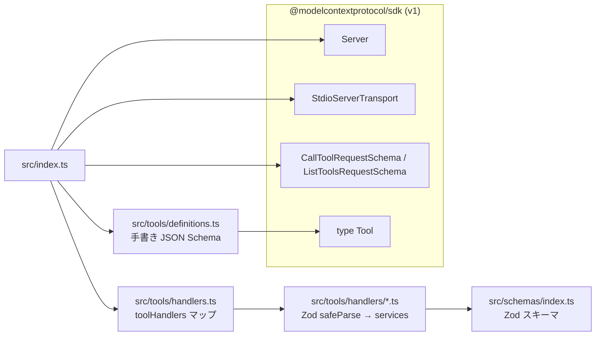
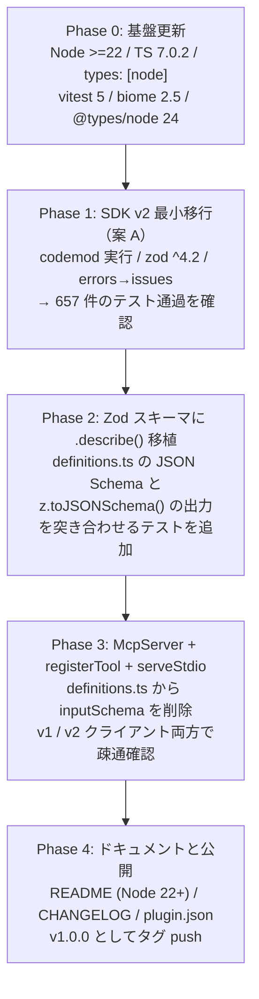

# epsg-mcp 現状確認と MCP SDK v2 移行計画

作成日: 2026-09-06 (JST)
対象: `@shuji-bonji/epsg-mcp` v0.9.10（`main` = `0a154ed`）

このドキュメントは、epsg-mcp の現在の状態を確認した結果と、`@modelcontextprotocol/sdk` v1 から SDK v2（`@modelcontextprotocol/server`）へ移行するための計画をまとめたものです。計画の各項目は、リポジトリの複製（クローン）上で実際にビルドとテストを通して確認しています。

---

## 1. 現状

### 1.1 リポジトリと公開状況

| 項目 | 値 |
|---|---|
| ローカル `main` | `0a154ed chore: release v0.9.10 — .claude-plugin/plugin.json 追加`（2026-07-14 06:44 JST） |
| `origin/main` との差 | なし（`## main...origin/main`）。未追跡は `.claude/` のみ |
| npm `latest` | 0.9.10（2026-07-14 06:46 JST 公開） |
| 依存 | `@modelcontextprotocol/sdk ^1.25.3`（lock は 1.29.0）、`zod ^3.25.76` |
| devDependencies | `typescript ^5.9.3`、`vitest ^3.0.5`、`@biomejs/biome ^2.3.13`、`@types/node ^25.1.0` |
| `engines.node` | `>=18.0.0`（README のバッジも Node.js 18+） |
| CI | Node 22 / 20 / 24 のマトリクス。lint → build → test |
| 公開 | タグ push で npm Trusted Publisher（OIDC）により公開 |

### 1.2 品質状態（クローンを Node 22 で実行）

`npm ci` → `vitest run` は 18 ファイル 657 件すべて成功、`biome lint .` は 87 ファイル指摘なし、`tsc --noEmit` はエラーなしでした。現時点で壊れている箇所はありません。

補足: 接続されたフォルダー上では `node_modules` に macOS (arm64) 用のバイナリ（`@rollup/rollup-darwin-arm64`、`@biomejs/cli-darwin-arm64`）しか入っていないため、Linux VM から `npm test` を実行すると `MODULE_NOT_FOUND` で落ちます。プロジェクトの問題ではないので、確認は GitHub からのクローンで行いました。

### 1.3 SDK に依存しているコード

SDK を import しているのは 2 ファイルだけです。



現在の構成では、ツールの入力定義が 2 か所にあります。`src/tools/definitions.ts` の JSON Schema（各フィールドに `description` あり）が `tools/list` に返され、`src/schemas/index.ts` の Zod スキーマ（`description` なし）がハンドラー内の検証に使われています。この二重管理が v2 移行で扱う中心的な論点になります。

---

## 2. MCP SDK v2 の把握

### 2.1 パッケージ構成

v2 では単一パッケージ `@modelcontextprotocol/sdk` が用途別に分割されました。epsg-mcp が必要とするのは `@modelcontextprotocol/server` だけです。

| パッケージ | 役割 | epsg-mcp での要否 |
|---|---|---|
| `@modelcontextprotocol/server` 2.0.0 | サーバー本体。`McpServer`、`Server`、`registerTool`。サブパス `./stdio` に `serveStdio` と `StdioServerTransport` | 必要 |
| `@modelcontextprotocol/core` 2.0.0 | 型と Zod スキーマ。`server` が依存として引き込む | 直接依存は不要 |
| `@modelcontextprotocol/client` | クライアント | テストで使うなら devDependencies |
| `@modelcontextprotocol/node` / `express` / `hono` / `fastify` | HTTP 用アダプター | 不要（stdio のみ） |
| `@modelcontextprotocol/server-legacy` | v1 の SSE 等を凍結したもの | 不要 |

公開日は 2026-07-28 08:55 JST（`2026-07-27T23:55Z`）。同日に v1 系の最終保守版 1.30.0 も公開されています。`engines.node` は `>=20`、依存は `zod ^4.2.0` です。

### 2.2 v1 → v2 の主な変更点（epsg-mcp に関係するもの）

| 項目 | v1 | v2 |
|---|---|---|
| import パス | `@modelcontextprotocol/sdk/server/index.js`、`.../server/stdio.js`、`.../types.js` | `@modelcontextprotocol/server`、`@modelcontextprotocol/server/stdio` |
| 低レベルハンドラー登録 | `setRequestHandler(CallToolRequestSchema, fn)` | `setRequestHandler('tools/call', fn)`（メソッド名の文字列） |
| ハンドラー第 2 引数 | `extra` | `ctx`（`ctx.mcpReq.signal` など） |
| ツール登録 | `server.tool(name, desc, shape, fn)` | `server.registerTool(name, { description, inputSchema: z.object({...}) }, fn)`。`inputSchema` は Standard Schema 準拠のオブジェクト（Zod の `z.object`）で、生の JSON Schema は渡せない |
| stdio 起動 | `new StdioServerTransport()` + `server.connect(transport)` | `serveStdio(() => createServer())`（`StdioServerTransport` も残っている） |
| Zod | 3.25+ または 4.0+ | 4.2.0 以上。`ZodError.errors` は削除され `ZodError.issues` を使う |
| エラークラス | `McpError` / `ErrorCode` | `ProtocolError` / `ProtocolErrorCode`、`SdkError` / `SdkErrorCode` |
| プロトコル | 2025-06-18 まで | 2026-07-28 に対応。2025 世代のクライアントには `legacy: 'serve'`（既定）で従来どおり応答 |
| JSON Schema 方言 | draft-07 相当 | `tools/list` の `inputSchema` に `"$schema": "https://json-schema.org/draft/2020-12/schema"` が付く |

出典: [Upgrade to v2](https://ts.sdk.modelcontextprotocol.io/v2/migration/upgrade-to-v2.html)、[2026-07-28 protocol support](https://ts.sdk.modelcontextprotocol.io/v2/migration/support-2026-07-28)、[Stdio serving](https://ts.sdk.modelcontextprotocol.io/v2/serving/stdio.html)。

### 2.3 `serveStdio` の仕様（`@modelcontextprotocol/server/stdio` の型定義から）

```ts
type McpServerFactory = (ctx: McpRequestContext) => McpServer | Server | Promise<McpServer | Server>;

interface ServeStdioOptions {
  legacy?: 'serve' | 'reject';   // 既定 'serve'。2025 世代の initialize をそのまま受ける
  transport?: Transport;          // 既定は process.stdin/stdout の StdioServerTransport
  onerror?: (error: Error) => void;
  maxSubscriptions?: number;      // 既定 1024
}

interface StdioServerHandle { close(): Promise<void>; }

declare function serveStdio(factory: McpServerFactory, options?: ServeStdioOptions): StdioServerHandle;
```

動作は次のとおりです。stdio は 1 接続なので、最初の `initialize` を受けた時点でファクトリーが 1 回呼ばれ、そのインスタンスが接続の間ずっと使われます。ファクトリーは `Promise` を返してもかまいません。`handle.close()` はサーバーインスタンスとトランスポートを閉じます。`stdout` は JSON-RPC 専用なので、ログは従来どおり `stderr` に出します（epsg-mcp の `utils/logger.ts` は既に stderr に出しているので変更不要です）。

### 2.4 実機確認の結果

クローン上で v2 に書き換えたサーバーを、v2 クライアント（`@modelcontextprotocol/client`）と v1 クライアント（`@modelcontextprotocol/sdk@1.30.0`）の両方から呼び出しました。

| 確認内容 | 結果 |
|---|---|
| v2 クライアントから `tools/list` | 9 ツールすべて返る。`client.getProtocolEra()` は `'modern'` |
| v2 クライアントから `recommend_crs` 呼び出し | 従来と同じ結果 JSON |
| v1 クライアント（1.30.0）から `tools/list` と `search_crs` | 従来と同じ結果。`legacy: 'serve'` により 2025 世代のまま応答 |
| 不正入力（`purpose: 'xxx'`） | SDK 側の検証で拒否され、`isError: true`、本文は `Input validation error: Invalid arguments for tool recommend_crs: purpose: Invalid option: expected one of ...` |

最後の項目は挙動の変化です。現在は `{"text":"Validation failed: purpose: ...","code":"VALIDATION_ERROR"}` という JSON 文字列を返していますが、`registerTool` に Zod スキーマを渡すと SDK がハンドラーより前に検証するため、ハンドラー内の `safeParse` には到達しません。ハンドラーの `safeParse` と `ValidationError` は、ハンドラーを直接呼ぶテスト（`tests/tools/handlers.test.ts`）のために残して問題ありませんが、MCP 経由で返るエラー文の形式は変わります。CHANGELOG に明記する必要があります。

---

## 3. Node.js と TypeScript 7

### 3.1 Node.js

| 系 | 状態（2026-09-06 時点） | 判断 |
|---|---|---|
| 20 | 2026-04 に EOL。SDK v2 の下限は 20 だが epsg-mcp では対象外にする | CI から外す |
| 22 "Jod" | Maintenance LTS。最新 22.23.2 | `engines.node: ">=22"` の基準にする |
| 24 "Krypton" | Active LTS。最新 24.20.0 | CI に含める |
| 26 | Current。最新 26.8.1（2026-08-26） | 2026-10 に LTS 化予定。CI の任意ジョブとして追加してもよい |

`engines.node` を `>=18.0.0` から `>=22` に上げるのは互換性を破る変更なので、バージョンは 1.0.0 に上げるのが自然です（0.9.x の段階で SDK v2 対応とあわせて区切りをつける）。

### 3.2 TypeScript 7

TypeScript 7.0（Go で書き直されたネイティブ版、いわゆる tsgo）は 2026-07-09 00:55 JST（`2026-07-08T15:55Z`）に `typescript@7.0.2` として npm の `latest` になっています。`npm i -D typescript` で入るのは既に 7 系です。

クローンで `typescript@7.0.2` に上げて `tsc --noEmit` を実行したところ、エラーは 1 種類だけでした。

```
src/index.ts(8,31): error TS2591: Cannot find name 'node:module'. ... add 'node' to the types field in your tsconfig.
```

原因は TypeScript 6.0 / 7.0 で `types` の既定が `["*"]` から `[]` に変わったことです。`tsconfig.json` に `"types": ["node"]` を足すだけで解消し、その後 `npm run build`、`biome check .`、`vitest run`（657 件）はすべて成功しました。

現在の `tsconfig.json` の他の項目（`module: Node16`、`moduleResolution: Node16`、`esModuleInterop: true`、`resolveJsonModule`、`rootDir: ./src`）は 7.0 でもそのまま使えます。7.0 で削除されたのは `moduleResolution: node/node10/classic`、`baseUrl`、`target: es5` などで、epsg-mcp は該当しません。`Node16` は `nodenext` に置き換えるのが今後の推奨ですが、必須ではありません。

注意点は 2 つあります。TypeScript 7.0 は安定した API（`typescript` パッケージをライブラリとして使う口）をまだ公開していないので、Angular や Svelte のテンプレート型検査などは対応待ちですが、epsg-mcp は `tsc` コマンドでビルドするだけなので影響しません。また、Vitest は esbuild で変換するため `typescript` のバージョンに依存しません。

出典: [Announcing TypeScript 7.0](https://devblogs.microsoft.com/typescript/announcing-typescript-7-0/)、[Announcing TypeScript 6.0](https://devblogs.microsoft.com/typescript/announcing-typescript-6-0/)。

---

## 4. 移行方針

### 4.1 2 つの選択肢

| | 案 A: 最小移行 | 案 B: `serveStdio` + `registerTool`（推奨） |
|---|---|---|
| 内容 | codemod の結果をそのまま採用。`Server` + `StdioServerTransport` + `setRequestHandler('tools/list' / 'tools/call')` | `McpServer` + `registerTool` + `serveStdio`。Zod スキーマを `inputSchema` として渡す |
| `definitions.ts` の JSON Schema | そのまま使う | 削除し、Zod スキーマから SDK が生成する |
| 入力検証 | ハンドラー内 `safeParse`（現状どおり） | SDK が先に検証。ハンドラーの `safeParse` は二重になる（無害） |
| エラー文 | 現状どおり | `Input validation error: ...` に変わる |
| `tools/list` の `description` | 現状どおり | Zod スキーマに `.describe()` を移植しないと **フィールドの説明が消える**（実機確認済み） |
| 変更量 | 3 ファイル、約 15 行 | `index.ts` 書き換え + `schemas/index.ts` に `.describe()` 追加 + `definitions.ts` 縮小 |

案 A は codemod（`npx @modelcontextprotocol/codemod@latest v1-to-v2 .`）が自動で出力する形で、`zod` を 4 系にして `src/errors/index.ts` の `zodError.errors` を `zodError.issues` に直せば、657 件のテストがそのまま通ります（確認済み）。ただし v1 と同じ書き方を v2 の上で続けるだけなので、`serveStdio` の利点（世代判定を SDK に任せる、`close()` で片付ける）は得られません。

案 B は要望どおり `serveStdio(createServer)` の形にするもので、入力定義を Zod 一本に統一できます。代わりに、`definitions.ts` にある各フィールドの `description` を Zod 側へ `.describe()` として移す作業が必要です。ここを省くと LLM に渡される説明が減り、ツールの使われ方が悪くなります。

### 4.2 推奨する進め方

案 B を採用しつつ、案 A の状態を経由して段階的に進めます。各段階でテストが通る状態を保てます。



### 4.3 各 Phase の作業内容

**Phase 0: 基盤更新**

`package.json` の `engines.node` を `">=22"` に、`devDependencies` を `typescript ^7.0.2`、`vitest ^5.0.0`、`@biomejs/biome ^2.5.12`、`@types/node ^24` に上げます。`tsconfig.json` に `"types": ["node"]` を追加します。CI のマトリクスは `[22, 24]` にします。ここまでは SDK に触れないので、独立した PR にできます。

**Phase 1: SDK v2 最小移行**

```bash
npx @modelcontextprotocol/codemod@latest v1-to-v2 .
npm i zod@^4.2.0
npx biome format --write src/index.ts src/tools/definitions.ts
```

codemod は `package.json`（`@modelcontextprotocol/sdk` を削除し `@modelcontextprotocol/server ^2.0.0` を追加）、`src/index.ts`（import と `setRequestHandler` の引数）、`src/tools/definitions.ts`（`Tool` 型の import 元）の 3 ファイルを書き換えます。`@mcp-codemod-error` マーカーは出ませんでした。加えて `src/errors/index.ts` の 9 行目を `zodError.issues.map(...)` に直します。`zod` 4 系では `import { z } from 'zod'` の本体が v4 なので、import 文の変更は不要です。

**Phase 2: Zod スキーマへの `.describe()` 移植**

`src/schemas/index.ts` の各フィールドに、`definitions.ts` の `description` を `.describe('...')` として付けます。`limit: z.number().min(1).max(100).optional().default(10)` のように `.default()` を持つフィールドは、SDK が生成する JSON Schema に `"default": 10` が入ることを確認済みです。

移植漏れを防ぐため、次のようなテストを追加します。`z.toJSONSchema(SearchCrsSchema, { target: 'draft-2020-12', io: 'input' })` の `properties.*.description` と `definitions.ts` の `inputSchema.properties.*.description` が一致することを 9 ツール分検証します（`io: 'input'` を付けると、`.default()` を持つフィールドが `required` に入らず、SDK が `tools/list` に出す形と同じになります）。この段階では `definitions.ts` はまだ残しておきます。

**Phase 3: `McpServer` + `registerTool` + `serveStdio`**

`src/index.ts` を書き換えます。プロトタイプ（クローンでビルド・疎通確認済み）は付録 A に載せています。要点は次のとおりです。

`createServer()` が `McpServer` を作り、9 ツールを `registerTool(name, { description, inputSchema: ZodSchema }, callback)` で登録します。`main()` はデータのプリロード（`loadPacksFromEnv()`、`preloadAll()`、必要なら `initSqliteDb()`）を待ってから `serveStdio(() => createServer())` を呼び、返った `handle` を `SIGINT` / `SIGTERM` で `close()` します。プリロードはプロセスで 1 回だけ行うので、ファクトリーの外に置きます。

`definitions.ts` からは `inputSchema` を取り除き、`name` と `description` の配列だけにします（または `index.ts` 内のテーブルに畳み込みます）。`toolHandlers` と `handlers/*.ts` は変更不要です。

**Phase 4: ドキュメントと公開**

README / README.ja.md の Node バッジと必要環境を 22+ に、`.claude-plugin/plugin.json` と `package.json` の `version` を 1.0.0 にします。CHANGELOG には、Node 18/20 のサポート終了、`@modelcontextprotocol/server` 2.x への移行、不正入力時のエラー文の変更（`{"text":..., "code":"VALIDATION_ERROR"}` から `Input validation error: ...` へ）、`tools/list` の `inputSchema` に `$schema`（draft 2020-12）が付くようになったことを書きます。

### 4.4 見送るもの

HTTP トランスポート（`createMcpHandler`）、`subscriptions/listen`、`inputRequired()`（多段リクエスト）は 2026-07-28 仕様の新機能ですが、epsg-mcp は stdio で 9 ツールを提供するだけなので、今回は使いません。`outputSchema` の追加は、結果を JSON 文字列で返す現在の形式を変えることになるので、別の課題として切り出します。

---

## 5. 確認に使った環境

- クローン: `https://github.com/shuji-bonji/epsg-mcp.git` の `0a154ed` を Node v22 で `npm ci`
- SDK: `@modelcontextprotocol/server@2.0.0`、`@modelcontextprotocol/core@2.0.0`、`@modelcontextprotocol/client@2.0.0`、`zod@4.5.4`
- v1 クライアント: `@modelcontextprotocol/sdk@1.30.0`
- TypeScript: 7.0.2

---

## 付録 A: `src/index.ts` プロトタイプ（案 B）

クローン上で `tsc`（7.0.2）のビルドを通し、v1 / v2 クライアントからの疎通を確認したものです。`definitions.ts` の `tools` 配列から `name` と `description` を使い、`inputSchema` は Zod スキーマに置き換えています。

```ts
#!/usr/bin/env node

import { createRequire } from 'node:module';
import { McpServer } from '@modelcontextprotocol/server';
import { serveStdio } from '@modelcontextprotocol/server/stdio';
import type { z } from 'zod';
import { preloadAll } from './data/loader.js';
import { initSqliteDb, isSqliteAvailable } from './data/sqlite-loader.js';
import { formatErrorResponse } from './errors/index.js';
import { getRegisteredPacks, loadPacksFromEnv } from './packs/pack-manager.js';
import * as schemas from './schemas/index.js';
import { tools } from './tools/definitions.js';
import { toolHandlers } from './tools/handlers.js';
import { error, info, PerformanceTimer } from './utils/logger.js';

const require = createRequire(import.meta.url);
const { version } = require('../package.json');

const inputSchemas: Record<string, z.ZodType> = {
	search_crs: schemas.SearchCrsSchema,
	get_crs_detail: schemas.GetCrsDetailSchema,
	list_crs_by_region: schemas.ListCrsByRegionSchema,
	recommend_crs: schemas.RecommendCrsSchema,
	validate_crs_usage: schemas.ValidateCrsUsageSchema,
	suggest_transformation: schemas.SuggestTransformationSchema,
	compare_crs: schemas.CompareCrsSchema,
	get_best_practices: schemas.GetBestPracticesSchema,
	troubleshoot: schemas.TroubleshootSchema,
};

function createServer(): McpServer {
	const server = new McpServer({ name: 'epsg-mcp', version }, { capabilities: { tools: {} } });

	for (const tool of tools) {
		const handler = toolHandlers[tool.name];
		const inputSchema = inputSchemas[tool.name];
		if (!handler || !inputSchema) {
			throw new Error(`No handler or schema registered for tool: ${tool.name}`);
		}
		server.registerTool(
			tool.name,
			{ description: tool.description, inputSchema },
			async (args: unknown) => {
				try {
					const result = await handler(args);
					return { content: [{ type: 'text', text: JSON.stringify(result, null, 2) }] };
				} catch (err) {
					const formatted = formatErrorResponse(err);
					error(`Tool ${tool.name} failed`, { error: formatted.text });
					return {
						content: [{ type: 'text', text: JSON.stringify(formatted, null, 2) }],
						isError: true,
					};
				}
			}
		);
	}
	return server;
}

async function preload() {
	info('EPSG MCP Server: Preloading data...');
	const timer = new PerformanceTimer('preload');
	const epsgDbPath = process.env.EPSG_DB_PATH;
	const loadTasks: Promise<unknown>[] = [loadPacksFromEnv(), preloadAll()];
	if (epsgDbPath) loadTasks.push(initSqliteDb(epsgDbPath));
	await Promise.all(loadTasks);
	const loadTime = timer.end();
	const packs = getRegisteredPacks();
	const sqliteStatus = isSqliteAvailable() ? 'SQLite: enabled' : '';
	info(
		`EPSG MCP Server: Data loaded in ${loadTime}ms (${packs.length} pack(s): ${packs.map((p) => p.countryCode).join(', ') || 'none'}${sqliteStatus ? `, ${sqliteStatus}` : ''})`
	);
}

async function main() {
	await preload();
	const handle = serveStdio(() => createServer(), {
		onerror: (err) => error('stdio error', { error: err.message }),
	});
	process.on('SIGINT', () => void handle.close());
	process.on('SIGTERM', () => void handle.close());
	info('EPSG MCP Server running on stdio');
}

main().catch((err) => {
	error('Failed to start server', { error: err instanceof Error ? err.message : String(err) });
	process.exit(1);
});
```

## 付録 B: Phase 0 + 1 の差分（クローンで確認した内容）

```diff
--- package.json
-		"node": ">=18.0.0"
+		"node": ">=22"
-		"@modelcontextprotocol/sdk": "^1.25.3",
-		"zod": "^3.25.76"
+		"@modelcontextprotocol/server": "^2.0.0",
+		"zod": "^4.2.0"
-		"typescript": "^5.9.3",
+		"typescript": "^7.0.2",

--- tsconfig.json
 		"resolveJsonModule": true,
+		"types": ["node"]

--- src/errors/index.ts
-		const messages = zodError.errors.map((e) => `${e.path.join('.')}: ${e.message}`).join(', ');
+		const messages = zodError.issues.map((e) => `${e.path.join('.')}: ${e.message}`).join(', ');

--- src/index.ts（codemod による書き換え）
-import { Server } from '@modelcontextprotocol/sdk/server/index.js';
-import { StdioServerTransport } from '@modelcontextprotocol/sdk/server/stdio.js';
-import { CallToolRequestSchema, ListToolsRequestSchema } from '@modelcontextprotocol/sdk/types.js';
+import { Server } from '@modelcontextprotocol/server';
+import { StdioServerTransport } from '@modelcontextprotocol/server/stdio';
-server.setRequestHandler(ListToolsRequestSchema, async () => {
+server.setRequestHandler('tools/list', async () => {
-server.setRequestHandler(CallToolRequestSchema, async (request) => {
+server.setRequestHandler('tools/call', async (request) => {

--- src/tools/definitions.ts
-import type { Tool } from '@modelcontextprotocol/sdk/types.js';
+import type { Tool } from '@modelcontextprotocol/server';
```
